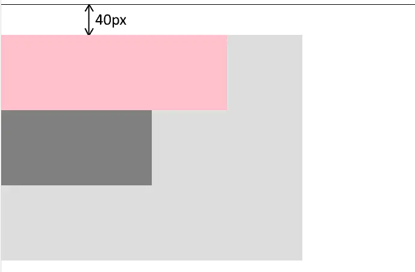
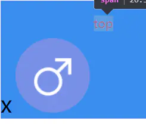
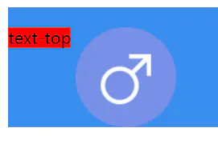
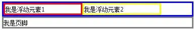
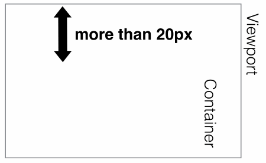

0.小点

1. `outline` l轮廓线

   `none | dotted | dashed | solid | double | groove | ridge | inset | outset | inherit`

2. `text-shadow:x,y,blur(模糊半径),color`

3. `white-space:nowrap` 不换行，强行一行显示

4. 解决div边框重叠问题，

   ```css
   margin:0px -1px -1px 0px ;
   ```

5. `em` 单位基于使用他们的元素的字体大小。 

   rem` 单位基于`  `html` 元素的字体大小。

6. `zoom：1` 

   设置或检索对象的缩放比例，触发IE浏览器的haslayout属性，解决浮动，margin重叠等一些问题。老版本使用

7. `    <meta http-equiv="refresh" content="s;url='...'">` s秒后跳转到指定页面


#### 1.margin **外边距塌陷**（垂直方向）

- 相邻的兄弟姐妹元素（除非后者兄弟姐妹需要清除过去的浮动）

  - 相邻的两个兄弟元素之间的外边距会取两者之前的最大值进行合并。
  - 前者浮动，后者清除浮动，后者会忽略前者在标准文本流中位置，往往由于后者设置的margin-top不够而导致塌陷

  

- 块级父元素与其第一个/最后一个子元素

  - 此时这个父元素对外展现出来的外边距将直接变成这个父元素和其第一个子元素的margin-top的较大者，而父元素与该子元素之间边距消失

  - 最后一个子元素的下边框同理

  - ```
    <body>
      <div class='parent'>
        <div class='child1'></div>
        <div class='child2'></div>
      </div>  
    </body>
    // css
    .parent{
      width:400px;
      height:300px;
      background:#ddd;
    }
    .child1{
    	 margin-top:40px;
    	 
      width:300px;
      height:100px;
      background:pink;
    }
    .child2{
      width:200px;
      height:100px;
      background:gray;
    }
    ```

    

  - 

- 空块元素

  - 如果存在一个空的块级元素，其border、padding、inline content、height、min-height都不存在，那么此时它的上下边距中间将没有任何阻隔，此时它的上下外边距将会合并。


**解决**

1. 给父元素设置padding
2. 给父元素设置边框
3. 给父元素加overflow：hidden。（BFC）


#### 2.vertical-align 基线对齐

设置`行内元素`对齐方式

虽然`vertical-align`属性只会在`inline-block`水平的元素上期作用，但是其影响到的元素涉及到`inline`属性的元素

1. `vertical: top/bottom`（内联）元素的顶边和行内最高元素的顶边对齐

   

   ```html
   <div style="background: #398dee;padding-top:20px">
       <span style="font-size: 30px">x</span>
       
       <span style="color: red; vertical-align: top;">top</span>
   </div>
   ```

2. text-top：元素顶边和父级的内容区域顶边对齐

   

   ```xml
   <div style="background: #398dee; padding-top: 20px">
       <span style="background-color: red;">text-top</span>
       
   </div>
   ```

#### 3.float

浮动float的本意：让文字像流水一样环绕图片



**浮动闭合（清除浮动）**

```css
  .clearfix:after{/*伪元素是行内元素 正常浏览器清除浮动方法*/
      content:'	',
      height:0,
      clear:both,
      visibility:hidden,
      display:block
}

```


``` html

<body>
    <div class="fahter clearfix">
        <div class="big">big</div>
        <div class="small">small</div>
        <!--<div class="clear">额外标签法</div>-->
    </div>
    <div class="footer"></div>

```

#### 4.二维动画

1. `transform`变形动画 (让元素变成什么样子)

   1. `transform-origin:(left,bottom)`基点
   2. `transform:rotae(n deg)`旋转
   3. `:scale(n|x,y)` 缩放
   4. `：translate(x,y)`平移
   5. `:skew(x deg,y deg)` 扭曲

2. `transition`过渡动画 (元素变化的过程)

   一般配合 `:hover`

   **谁做过渡给谁加**

   1. transition-property（哪些属性的改变会有这种平滑过渡的效果）；
      - none
      - all
      - 元素名
   2. transition-duration（变换延续的时间）
   3. transition-timing-function（变换的速率）
   4. transition-delay（变换的延时）

   ```html
   <style>
       .box {
           width: 100px;
           height: 100px;
           background: #bfa;
   
           transition: transform 1s;
       }
       .box:hover {
           transform: translate(100px, 200px);
       }
   </style>
   <body>
       <div class="box"></div>
   </body>
   ```

   

3. `animation`帧动画

   ````css
   @keyframes animationName {
       0% {
           properties: value;
       }
       percentage {
           properties: value;
       }
       100% {
           properties: value;
       }
   }
   ​```
   
   1. `animation-name:` 调用动画，之前设置的动画名
   
   2. `animation-duration`持续时间
   
   3. `animation-timing-function`属性定义了动画的播放速度曲线。
   
      可选配置参数为:
      `ease`、
      `ease-in`、
      `ease-out`、
      `ease-in-out`、
      `linear`、
      `cubic-bezier(number, number, number, number)`
   
      `steps()`步长，动画需要多少步能完成
   
   4. `animation-direction`属性表示CSS动画是否反向播放。
   
      可选配置参数为:
   
      `normal`
   
      `reverse`
   
      `alternate`交替
   
      `alternate-reverse`反向交替
   
   5. 动画延迟（animation-delay）单位秒
   
   6. 动画迭代次数（animation-iteration-count）
   
      `number`
   
      `infinite`
   
   7. `animation-fill-mode` forwards | backwards 动画结束后是否停留在最后一帧
   
   8. 整合
   
      eg.`animation: namexx 1s linear 0s 1 alternate forward`
   ````

#### 5.3d动画


#### 6.bootstrap

##### 1.基本规则

1. 十二栅格适配

   `<div class='container'></div>`十二栅格包裹，有留边

   `.container-fluid` 占屏幕100%

   布局规则是`容器` `行` `列` 

   ```html
   <div class='container'>
       <div class='row'>
           <div class='col-xx-x'>
               
           </div>
       </div>
   </div>
   ```


#### 7.媒体查询

- 最小 和 最大 范围

```css
@media screen and (min-width:600px) and (max-width:900px){
  body {background-color:#f5f5f5;}
}
```

- 兼容移动设备（手机、平板）

  ```html
  <meta name="viewport" content="width=device-width, initial-scale=1.0, minimum-scale=1.0, maximum-scale=1.0, user-scalable=no">
  
  ```

  


#### 8.iframe


#### 9.BFC

BFC就是页面上的一个隔离的独立容器，容器里面的子元素不会影响到外面的元素。 

**创建：**

1. 浮动元素（元素的float不是 `none`，指定float为left或者right就可以创建BFC）

   1. BFC的区域不会与浮动的元素区域重叠。

      ![Image [2]](assets/Image [2].png)

      ```html
      <div class="left"></div>
      <div class="right"></div>
      ```

      制作两栏布局 右边自适应宽度

      ```css
      .left {
        width: 200px;
        height: 100px;
        background-color: green;
        float: left;
      }
      
      .right {
        height: 100px;
        background-color: red;
        overflow: hidden; /* 创建BFC */
      }
      
      ```

   2. 清除左盒子浮动后，后面盒子出现的文字环绕

2. 绝对定位元素（元素的 `position`为 `absolute` 或 `fixed`）

3. display:inline-block，display:table-cell，display:flex，display:inline-flex

4. overflow指定除了visible的值

   1. 给父元素加`overflow:hidden`，解决外边距塌陷
   2. 给父元素（无定高）加`overflow:hidden`，解决子元素浮动后，父盒子高度塌陷

#### 10.positon:sticky

结合了 `position:relative` 和 `position:fixed`

```css
div{
    position:sticky,
    top[left,right,bottom]:n px
}
```

top是个阈值，在未到达top值前，元素的postion为`relative`；达到top后，position为`fiexd`




#### 11.border-image

```css
border-image:{
    url()
    裁剪宽度，[上，右，下，左
    重复性，[repeat，round，stretch
}
```


- 橙色四角是固定的，每个黄色的方形对应裁剪宽度的四个方向，先缩放至`border-width`的宽度大小，再执行重复性属性

  即，裁剪宽度 === 元素边框宽度

  ```css
  html {
                  font-size: calc(526px / 3);
              }
              .a {
                  width: 526px;
                  height: 526px;
                  border: 1rem solid gray;
                  border-image: url("./01d1d2554ba35d000001bf7238b520.jpg@1280w_1l_2o_100sh.jpg")
                      33% repeat;
              }
  ```

  

#### 12. offsetX,clientX,pageX,screenX


#### 13 vh/vw

`vh`: 相对于视窗的高度, 视窗被均分为100单位的vh; 
`vw`: 相对于视窗的宽度, 视窗被均分为100单位的vw;


#### 14 img+css 图片底部空白


原因：图片底部默认和文字的基线对齐，所以会有空白间隙

1. `img {display: block;}` 可以解决

2. 给图片加`vertical-align`属性 

   `vertical-align:middle/bottom/top;`