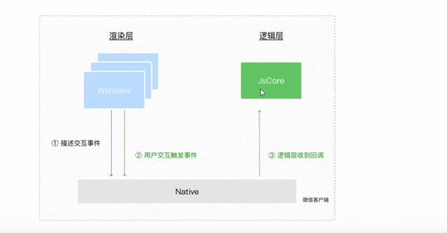

## 理论

### 1.宿主环境

**通信主体**


**页面渲染过程**


## 基础

### 1.常用组件

#### 1.1 view

等同div

#### 1.2 scroll-view

给定高度，实现纵向滚动

#### 1.3 swiper  swiper-item

轮播图组件

```js
<swiper class="sw-container" circular indicator-dots indicator-active-color="blue">
    <swiper-item>
    <view class="item">1</view>
</swiper-item>
<swiper-item>
        <view class="item">2</view>
</swiper-item>
<swiper-item>
            <view class="item">3</view>
</swiper-item>
</swiper>
```

- circular 循环轮播
- indicator-dots 带小点
- indicator-active-color="blue" 当前小点颜色


### 2.常用的api

#### 1.事件监听api

eg wx.onWindowResize(function callback) 监听窗口尺寸变化

#### 2.同步api

都以Sync结尾

eg wx.setStorageSync('key','wuhu~') 向本地存储中写入内容

#### 3.异步api

eg wx.request() 发起网络请求


### 3.1数据绑定

mustache语法 内容绑定 `{{}}`

在小程序中，不论是否绑定的是字符串内容还是data属性， 都需要 **mastache**

### **3.2修改数据值**

`setData（）` 接收一个对象，以键值对的形式表示

1. 可以设置一个或多个data数据

   

2. key可以以数据路径的形式给出

   

3. key值可以为变量，为变量的时候要用[ ]引起来

   

4. **不需要在this.data中预先定义，使用setData()方法会自动创建该数据**

   

   name在this.data中未定义，但是这种写法不会报错，而且还会在this.data.zhong创建name这条数据。可以用this.data.name获取到该条数据

   


### 4.事件绑定

事件是渲染层到逻辑层的通信方式，把用户在渲染层的行为，反馈到逻辑层



bindtap 或 bind:tap 绑定方式(冒泡)

catch(捕获)

- tap 手指点下
- input
- change

回调函数触发，会收到一个event对象

- type 事件类型
- timeStamp 页面打开到触发事件，经过的毫秒
- target (触发事件的源头组件)触发事件的组件的一些属性值集合，**常用**
- currentTarget (当前事件所绑定的组件))当前组件的一些属性值合集
  - 比如冒泡，点击内部元素，冒泡触发了外层元素的事件，此时
    - e.target 指向触发源头，就是内部元素
    - e.currentTarget 指向当前正在触发事件的组件，就是外层组件
    - 
- detail 额外信息
- touches 
- changedTouches


**传递参数：**

```js
<!-- 事件传参 -->
<button type="primary" bindtap='chuancan' data-bar="{{1}}"> btn</button>
```

bar 是自定义参数键名，花括弧中的是值

通过 `target.dataset`获取自定义的参数键名

```js
huancan(event){
    console.log(event.target.dataset.bar);
    this.setData({
        wuhu:this.data.wuhu + event.target.dataset.bar
    })
},
```


### 5.模板语法

#### 1.条件渲染

`wx:if={{criteria}}` 条件渲染 (删除组件)

配合 `<block>` 标签实现多组件判断，block本身不会被渲染


`hidden={{criteria}}` 条件为真就隐藏 (切换样式，none/block)


#### 2.列表渲染

```js
<!-- wxfor -->
<view wx:for="{{arr}}" wx:key="index">
索引是 {{index}} 值 {{item}}
</view>
<!-- wxfor 指定键名 键值 -->
<view wx:for="{{arr}}" wx:key="foo" wx:for-index='foo' wx:for-item='bar'>
索引是 {{foo}} 值 {{bar}}
```
