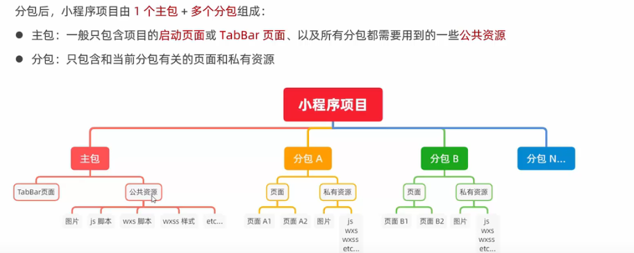
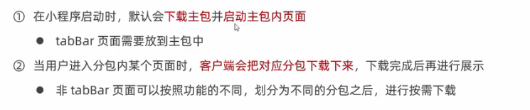

# 分包

为什么要分包？

1. 优化小程序首次使用的下载时间
2. 团队协作开发


## 1. 分包构成





## 2. 分包的加载规则




- 整个小程序所有分包大小不超过 20M
- 单个分包/主包大小不能超过 2M


## 3. 配置分包结构

root是该包的主文件夹，pages是分路径

```json
"subPackages": [{
    "root": "packageA",
    "name": "pet",
    "pages": [
        "pages/cat/cat",
        "pages/dog/dog"
    ]
}, {
    "root": "packageB",
    "name": "fruit",
    "pages": [
        "pages/apple/apple",
        "pages/banana/banana"
    ]
}],
```

**注意：**

1. tabBar 页面必须在主包里面
2. 分包内不能嵌套(没有vue那样的子路由)
3. 主包**不能使用**分包的私有资源(图片，js，wxs，wxss等)
4. 分包之间**不能互相使用**对方的私有资源
5. 分包**可以用**主包的私有资源


## 4. 独立分包

一般的分包不能被用户直接访问，需要通过主包跳转

独立分包则可以在**不下载主包**的情况下，独立运行


独立分包本身和主包，分包，其他独立分包，是**相互隔绝**的，不能互相使用私有资源


`"independent": true,` 配置在当前分包，和`root` 平级


## 5. 分包预下载

在app.json 中配置，键值对的形式

键名是触发分包预下载的页面，

`newwork` -〉all  ， wifi  触发下载的网络模式

`packages` 是下载的分包的 root名 或者 name名

```json
"preloadRule": {
    "pages/contact/contact":{
        "network": "all",
        "packages": ["pet"]
    }
},
```


**注意：**

所有预下载的分包，加起来的体积，不能超过**2mb**


