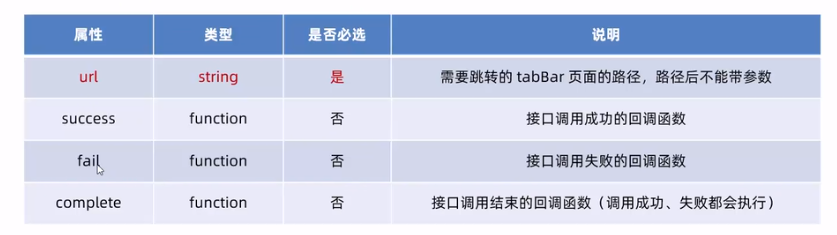

# 页面导航

### 1.导航跳转

1. 声明式导航

   声明一个 `<navigator>`导航组件，通过点击组件来实现跳转

   ```js
   <navigator url="/pages/home/home" open-type="switchTab">
       跳转到首页
   </navigator>
   ```

   - url是跳转地址

   - open-type=“switchTab”  是指定 此跳转为，tabBar类型

   - open-type="navigate" 可以跳到 **非tabBar** 页面 不写此属性，就默认为非tabBar

   - open-type="navigateBack" 后退  delta是回退的数量 不写数值默认是1

     ```js
     <navigator open-type="navigateBack" delta="1">
         后退1页
     </navigator>
     ```

     

2. 编程式导航

   调用小程序api来实现页面跳转

   `wx.switchTab(Object object)` 实现 ，跳转到tabBar页面，其中Object属性如下

   

   `wx.navigateTo(Object object)` 跳到**非tabBar**

   ```js
   toHome() {
       wx.switchTab({
           url: '/pages/home/home',
       })
   },
       toDetail() {
           wx.navigateTo({
               url: '/pages/detail/detail',
           })
       },
   ```

   回退：

   ```js
     getBack() {
           wx.navigateBack({
               delta: 1,
           })
       },
   ```

   

### 2.导航传参

1. 声明式传参

   ```js
   <navigator url="/pages/detail/detail?name=123&age=11">
       detail-传参
   </navigator>
   ```

2. 编程式传参

   ```js
    toDetail() {
           wx.navigateTo({
               url: '/pages/detail/detail?wuhu=123',
           })
       },
   ```

3. 获取参数

   ```js
   onLoad(options) {
           console.log(options);
           this.setData({
               query: options
           })
       },
   ```

   