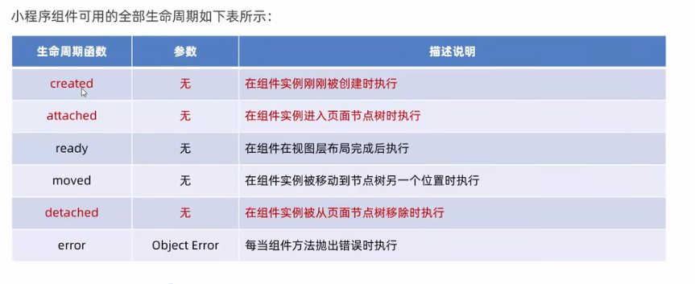
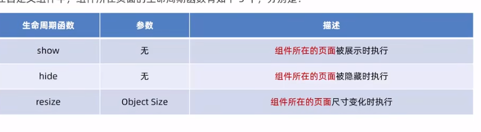
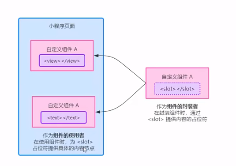

# 组件

## 1. 引用组件

### 1.1 局部引用

xxx.json

在页面的json中配置需要用到的组件路径

```json
{
  "usingComponents": {
      "my-test":"/components/test/test"
  }
}
```


### 1.2 全局引用

app.json

同上，这样所有的页面都可以使用了

```json
"usingComponents": {
        "my-test": "/components/test/test"
    }
```


### 1.3 组件和页面的区别

1. 组件的json文件需要声明 `"component":true` 属性
2. 组件的js文件调用的是 Component() 函数，页面调用的是 Page() 函数
3. 组件的方法要写到 methods{} 中


## 2. 组件样式

同vue一样，各组件样式互不影响。

app.wxss中的全局样式，对自定义组件无效

**只有class选择器受样式隔离的影响**，其他的，比如id，标签等选择器不受影响


可以在组件或者页面的js中配置`opitons -〉styleIsolation`选项，来改变其样式限制：

```js
options: {
    styleIsolation: 'shared', //全局和组件互相影响，会影响到其他页面中设置了，apply-shared的同名class属性
        // styleIsolation: 'apply-shared', //全局可以影响到组件
        // styleIsolation:'isolated',//启用样式隔离，全局不会影响到组件
}
```


## 3. 数据 方法 属性

为方便区分事件方法和自定义方法，自定义方法命名一般用**下划线开头**

```js
methods:{
    //事件方法
    addCount() {
        this.setData({
            count: this.data.count + 1
        })
        this._addInfo()
    },

        //自定义方法，一般一下划线开头，以便区分
        _addInfo() {
            wx.showToast({
                title: 'count + 1 !',
                image: '/images/21.png',
                mask: true
            })
        }
}
```

### 3.1 传参

**父传子**

在页面中，通过组件标签中自定义属性和参数值来传递

在组件中，用`properties` 接收

```js
//页面
<!-- 传递属性max，值为 9  -->
    <my-test max="9"></my-test>

//组件
properties: {
    // 接收传递来的属性
    // 简写
    // max:Number,

    // 一般写法
    max: {
        type: Number,
            //默认值
            value: 9,
    }
    },
```

*ps：data和properties 指向同一个对象(他们本质上是同一个东西，只是人为的做了名称的划分)，*

不同于vue，他们的数据都是**可读写的**


### 3.2 监听

n1,n2是监听的字段，

也可以监听对象，n1.xxx,n2.xxx

```js
observers: {
    'n1,n2': function (n1, n2) {
        this.setData({
            sum: n1 + n2
        })
    }
}
```

当监听的是对象中的多个属性时，可以用`*`代替

```js
'rgb.**': function (obj) {
    this.setData({
        fullColor: `${obj.r},${obj.g},${obj.b}`
    })
}
```


### 3.3 纯数据字段

当某些数据只是用于做逻辑处理，而不会被渲染到页面时，就可以把他们定义为纯数据字段，这样可以提高执行效率

```js
options: {
    //定义纯数据字段的正则，凡是以 _ 开头的，都会被视为纯数据字段
    pureDataPattern: /^_/
}，
data: {
    //纯数据字段
    _rgb: {
        r: 0,
            g: 0,
                b: 0
    },
        fullColor: '0,0,0'
},
```

## 4. 自定义组件生命周期



常用的有三个 created attached detached：

1. created 组件实例刚被创建好
   1. 此时不能调用 setData
   2. 通常在此处用于给组件的this添加一些自定义属性
2. attached 组件初始化完毕，进入页面节点树
   1. this.data已经被初始化完毕
   2. 绝大多数的初始化工作都在这里进行(比如发送网络请求)
3. detached 组件离开页面节点树后触发
   1. 退出一个页面时，会触发页面内每个自定义组件的detached
   2. 此处常做一些清理性的工作(比如解除事件监听器)


```js
//组件生命周期
lifetimes: {
    created() {
        console.log('created');
    },
        attached() {
            console.log('attached');
        },
            detached() {
                console.log('detached');
            }

},
```


## 5. 组件所在 *页面* 的生命周期

即，组件的一些行为，需要根据页面状态的变化来调整，这时就会用到了

可以理解成，监听页面的特定动作时，触发的函数



```js

//组件所在页面的生命周期
pageLifetimes:{
    show(){
        console.log('show');
    },
        hide(){
            console.log('hide');
        },
            resize(){
                console.log('resize');
            }
}
```


## 6.插槽



### 6.1 单个插槽

``` 
插槽组件
<view>
    wuhu
    <slot></slot>
</view>

页面
<my-test3>
    <view>填充的内容</view>
</my-test3>
```

默认只能使用1个插槽，多个需要在js中配置

```js
options: {
    //启用多个插槽
    multipleSlots: true
}
```


### 6.2 具名插槽

```html
插槽组件
<view>
    wuhu
    <slot name='foo'></slot>
    <slot name='bar'></slot>
</view>


页面
<my-test3>
    <view slot="foo"> 填充的内容foo</view>
    <view slot="bar"> 填充的内容bar</view>
</my-test3>
```


## 7. 组件传参

### 7.1 自定义属性传参

不同于vue，这个只能**传简单类型的值**，即，不能传递函数调用(不能通过像vue那样父组件给子组件传递一个自己的函数调用过去，来达到子传父的目的)

父

```js
<my-test4 foo="{{foo}}">

</my-test4>
```

子

```js
properties: {
    foo:Number
},
```


### 7.2 自定义事件传参

父

自定义事件名为 sync 事件触发的函数是syncNum

```js
<my-test4 bind:sync='syncNum'>
</my-test4>
```

子

在子组件中触发 父组件的自定义事件，**同时传递一个值**

```js
methods: {
    //自定义事件子传父
    c2p() {
        this.triggerEvent('sync', this.data.bar)
    }
}
```

父

通过事件的event对象，`e.detail`，获取传递来的参数

```js
//自定义事件函数传参
syncNum(e) {
    this.setData({
        bar: e.detail
    })
},
```


### 7.3 获取子组件实例对象

通过`this.selectComponent` 获取子组件实例对象，上面包含子组件所有的数据和方法

```js
<!-- 获取子组件实例 id class都可以 -->
    <my-test4 id="mt4" class="mt4"></my-test4>
<button bindtap="getChild">获取子组件 实例</button>

    ------------------
//获取子组件实例
getChild() {
    const child = this.selectComponent('#mt4')
    console.log(child.data.bar);
},
```


## 8. behaviors

同vue中的mixins一样

在外部 behavior.js 文件中定义共用的数据和方法，并且暴露

然后在需要用到的地方引入

```js
module.exports = Behavior({
    data:{
        name:'zh3ang'
    }
})

    -----------

    //引入 behaviors
    const myBehaviors = require('../../behaviors/myBehaviors')

Component({

    //behaviors
    behaviors:[myBehaviors],
})
```

