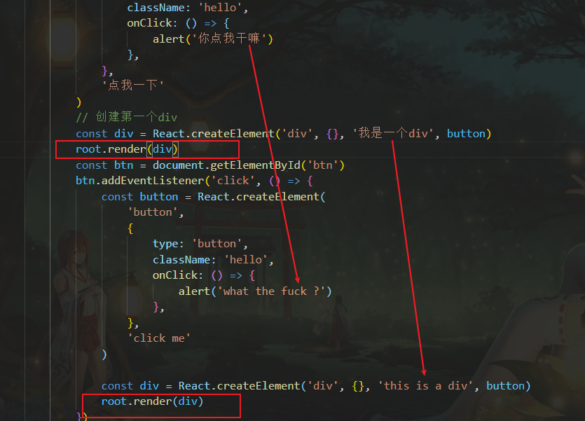

### 1. React.createElement

创建一个react元素

参数：

1. 元素名
2. 标签中的属性
   1. class要写作 className

   2. 事件属性要写成驼峰，事件的回调要写成函数

      ```js
      const button =React.creatElement('button',{
          id:'btn',
          onClick:() =>{
              ...
          }
      })
      ```

      

3. 元素的子元素(内容)

注意：

1. react元素最终会通过虚拟dom转换为真实dom
2. react元素一旦创建就**不能修改**，只能用新的来替换


### 2.render

#### root.render(xxx)

- 把react元素渲染到页面，根元素中存在的非react元素都会被删除
- 首次调用，容器节点中的所有dom元素都会被替换
- 后续再调用render，react会把两次渲染的内容进行比对，**确保只修改变化的元素**，以减少对dom的操作(diff) 


**例如：**

当渲染了同一个react元素时，react会对比前后两次render的虚拟dom中的内容，并且只在真实dom中，修改不同的内容



比如此处，render的div，变换的只有其中的字符串和button，所有react只会修改对应的这部分


### 3.ReactDOM.createRoot 

创建根元素，一个页面只有一个root元素，所有的元素都应该被托管到root里面

```js
const root = ReactDOM.createRoot(document.getElementById('root'))
```

