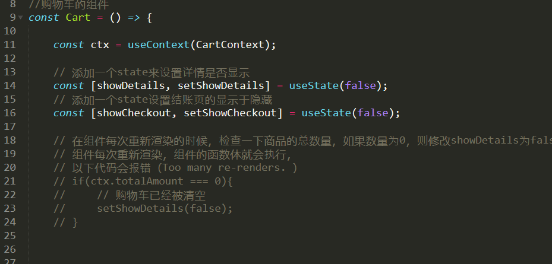
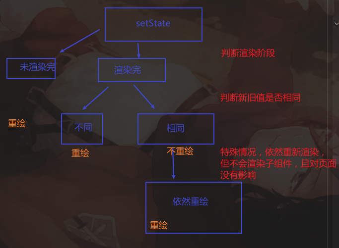

# Effect

> 部分逻辑代码可以直接写到函数体中，比如filter，map等。但是另一部分的逻辑代码可能会产生"副作用"
>
> 例如，如果直接将修改state的逻辑编写到了组件之中，就会导致组件不断的循环渲染，直至调用次数过多内存溢出。




## React.StrictMode

编写React组件时，我们要极力的避免组件中出现那些会产生“副作用”的代码。同时，如果你的React使用了严格模式，也就是在React中使用了`React.StrictMode`标签，

React并不能自动替你发现副作用，但是它会想办法让它显现出来，从而让你发现它。那么它是怎么让你发现副作用的呢？React的严格模式，在处于开发模式下，**会主动的重复调用一些函数**，以使副作用显现。所以在处于开发模式且开启了React严格模式时，这些函数会被调用两次：

>类组件的的 `constructor`, `render`, 和 `shouldComponentUpdate` 方法
>类组件的静态方法 `getDerivedStateFromProps`
>函数组件的函数体
>参数为函数的`setState`
>参数为函数的`useState`, `useMemo`, or `useReducer`


## 为什么setState会重新渲染

一般来说，如果旧值和setstate的新值相同，就不会触发触发重新渲染，但是这里触发了，为什么?

### setstate的执行流程

实际上他会调用`dispatchSetDate()`，这个函数会判断，当前组件处于什么阶段:

- 渲染未完成(这里直接写在函数体中就是这种情况)，跳过新旧值比对，直接重新渲染
- 渲染完成，就会检查是否相同:
  - 值不同，重新渲染
  - 值相同，则不重新渲染，但是
    - React在一些情况下会**继续执行当前组件的渲染**。 但是这个渲染不会触发其子组件的渲染，这次渲染**不会产生实际的效果**。 这种情况通常发生在值第一次相同时




## useEffect

### 1. 每次渲染都执行

钩子函数，接收一个执行的函数作为参数，参数函数会在**组件渲染完成后**执行，

并且**每次重新渲染**都会调用

```react
useEffect(() => setState(xx))
```

开发汇总，把可能会产生副作用的代码写在里面


### 2.依赖项改变时执行

可以接收第二个参数，一个**数组**   只有数组中的数据发生变化时，才会触发effect

```react
useEffect(() => {
    setState(foo)
        setState(foo)
}，[foo,bar])
```

*一般会把effect中使用到的数据都设置为依赖项*


### 3.只在页面渲染后执行一次

数组为空

```react
useEffect(() => {
    setState(foo)
}，[])
```


### 4.清理函数

在Effect的回调函数中，可以指定一个函数作为返回值
这个函数可以称其为清理函数，它会**在下次Effect执行前调用**
 可以在这个函数中，做一些工作来清除上次Effect执行所带来的的影响

```react
// 防抖
useEffect(()=>{

    // 降低数据过滤的次数，提高用户体验
    // 用户输入完了你在过滤，用户输入的过程中，不要过滤
    // 当用户停止输入动作1秒后，我们才做查询
    // 在开启一个定时器的同时，应该关掉上一次
    const timer = setTimeout(()=>{
        //发送请求。。。
    }, 1000);

    return () => {
        clearTimeout(timer);
    };

}, [keyword]);
```

