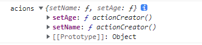
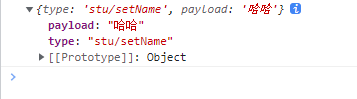
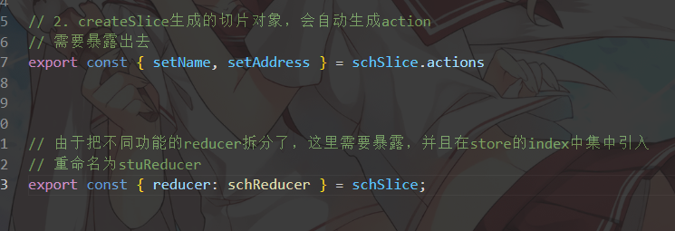
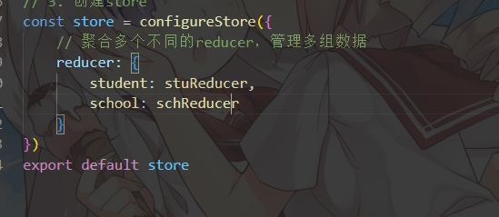
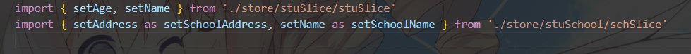

# redux

一个专为JS应用设计的**可预期**的状态容器

可预期，即，Redux中对状态所有的操作都封装到了容器内部，外部只能通过调用容器提供的方法来操作state，而不能直接修改state。

> Redux可以理解为是reducer和context的结合体，使用Redux即可管理复杂的state，又可以在不同的组件间方便的共享传递state。


## 1.在网页中的基本使用

>网页中使用redux的步骤：
>
>​             \*       1.引入redux核心包
>
>​             \*       2.创建reducer整合函数
>
>​             \*       3.通过reducer对象创建store
>
>​             \*       4.对store中的state进行订阅
>
>​             \*       5.通过dispatch派发state的操作指令

### 1.引入redux核心包

`<script src="https://unpkg.com/redux@4.2.0/dist/redux.js"></script>`


###  2.创建reducer整合函数

```react
const reducer = (state, action) => {
    /*
                 *   state 表示当前state，可以根据这个state生成新的state
                 *   action 是一个js对象，它里边会保存操作的信息
                 * */
    switch (action.type) {
        case 'ADD':
            return {...state, count: state.count + 1 }

        case 'SUB':
            return {...state, count: state.count - 1 }

        default:
            return state
    }
}
```


### 3. 通过reducer对象创建store

reducer是一个函数，是state操作的整合函数，

每次修改state时都会触发该函数(通过dispatch)，它的返回值会成为新的state。

默认值一般时一个对象,因为redux需要管理一大组数据

```react
 const store = Redux.createStore(reducer, {count:1})
```


### 4. 对store中的state进行订阅

**所有对state的操作都需要通过store**

`getState`这里是读取

 `subscribe()`方法接收一个函数作为参数，监听state的值,当store中的state**发生改变时**，就会调用

```react
store.subscribe(() => {
    countSpan.innerText = store.getState()
})
```


### 5. 通过dispatch派发state的操作指令

```react
subBtn.addEventListener('click', () => {
    store.dispatch({ type: 'SUB' })
})

addBtn.addEventListener('click', () => {
    store.dispatch({ type: 'ADD' })
})
```


单纯使用redux会带来的问题

```问题：
*   1.如果state过于复杂，将会非常难以维护
*       - 可以通过对state分组来解决这个问题，创建多个reducer，然后将其合并为一个
*   2.state每次操作时，都需要对state进行复制，然后再去修改
*   3.case后边的常量维护起来会比较麻烦
```

通过RTK来解决

## 2. RTK

Redux工具包

npm

```
npm install react-redux @reduxjs/toolkit -S
```

yarn

```
yarn add react-redux @reduxjs/toolkit
```


### 2.1 创建store

```react
import { configureStore, createSlice } from '@reduxjs/toolkit';

// 1. 切片对象
const stuSlice = createSlice({
    // 用于生成action中的type名
    name: 'stu',
    // 初始值对象
    initialState: {
        name: 'zhang3',
        age: 12,
        gender: 'male'
    },
    // 指定操作state数据的方法
    reducers: {
        setName (state, action) {
            // 这里可以对state直接修改，因为这里的state是一个代理对象
            state.name = 'alex'
        },
        setAge (state, action) {
            state.age = 23
        }
    }
})


// 2. createSlice生成的切片对象，会自动生成action
// 需要暴露出去
export const { setName, setAge } = stuSlice.actions
console.log('acions', stuSlice.actions);
// actions对象 中储存了自动生成action的函数创建器，调用后会自动生成对应的action对象

//action对象的结构 {type:name/函数名, payload:函数的参数} 我们可以传入payload值
const nameAction = -('哈哈');
console.log(nameAction);

// 3. 创建store
const store = configureStore({
    // 聚合多个不同的reducer，管理多组数据
    reducer: {
        student: stuSlice.reducer
    }
})
export default store
```

调用`stuSlice.actions`生成的action对象



action对象的结构

{type:name/函数名, payload:函数的参数} 我们可以传入payload值




### 2.2 使用store

index.js  在全局注册redux

```react
import { Provider } from 'react-redux'
import store from "./store";

root.render(
    // 全局使用redux管理 
    <Provider store={store}>
        <App />
    </Provider>
);
```

组件引入

#### 获取state数据

`useSelector()`接收一个函数，此处的state是管理的多组数据的聚合

#### 修改state数据

`useDispatch()`获取派发函数，往派发函数传入action对象即可

action对象即为store中暴露的actions函数创造器

```react
import React, { useCallback, useState } from 'react'
import { useDispatch, useSelector } from 'react-redux'
import { setName, setAge } from './store'


function App () {
    // 获取state数据 useSelector接收一个函数，此处的state是管理的多组数据的聚合
    const student = useSelector(state => state.student)

    // 修改state数据 useDispatch获取派发函数，往派发函数传入action对象即可
    // import 获取派发函数的action对象
    const dispatch = useDispatch()

    // 此处传入派发函数的第一个参数，就是payload
    const changeAge = () => {
        dispatch(setAge(100))
    }
    const changeName = () => {
        dispatch(setName('david'))
    }

    return (
        <div>
            {student.name}
            {student.age}
            <button onClick={changeName}>changeName</button>
            <button onClick={changeAge}>changeAge</button>

        </div>
    )
}

export default App
```

**一般需要把多组reducer进行拆分,再各自的页面暴露自己的reducer和action生成函数**

**再在store index中导入**

暴露



引入



使用时遇到重名的actions需要重命名



解构多组reducer保存的state


## 3.RTKQ

RTK不仅帮助我们解决了state的问题，同时，它还为我们提供了RTK Query用来帮助我们处理数据加载的问题

### `createApi`创建一个RTKQ对象

```react
import { createApi, fetchBaseQuery } from '@reduxjs/toolkit/dist/query/react';


// createApi创建一个RTKQ对象，所有的配置信息都写在里面,接受一个配置对象
const testApi = createApi({
    // api标识
    reducerPath: 'testApi',
    // 请求方式 以及基础查询信息
    baseQuery: fetchBaseQuery({ baseUrl: 'https://www.dmoe.cc/' }),
    // endpoints 用来指定Api中的各种功能，是一个方法，需要一个对象作为返回值
    endpoints (build) {
        // build是请求的构建器，通过build来设置请求的相关信息,由rtkq对象提供
        // 返回查询配置对象
        return {
            // build.query 是查询的请求类型 不同的请求对应不同的参数
            getTest: build.query({
                query () {
                    // 返回这条请求的配置信息
                    // 这个query是拼接的子路径
                    return 'random.php'
                },
                // 对响应结果做处理 baseQueryReturnValue是原来的响应结果
                transformResponse (baseQueryReturnValue, meta, arg) {
                    return baseQueryReturnValue.data
                },
                // 设置缓存时间，单位秒，默认60s
                keepUnusedDataFor:5,
            })
        }
    }
})

/* 页面需要调用这个请求api，要通过自动生成的钩子函数
    这个钩子函数需要我们命名并暴露
    钩子函数的命名规则 getStudents --> useGetStudentsQuery
*/
export const { useGetTestQuery } = testApi

// 还需要把rtqk对象暴露给store 挂载其自动生成的reducer
export default testApi
```

### 配置store

使用[ ]写入自动生成的type名称，

reducer也由RTKQ对象生成

```react
import { configureStore } from "@reduxjs/toolkit";
import testApi from "./stuAPI/stuAPI";

const store = configureStore({
    reducer: {
        // 这里的reducer是自动生成的
        [testApi.reducerPath]: testApi.reducer
    },
    // 配置中间件  解决什么缓存问题 不清楚
    /* 
        middleware:getDefaultMiddleware =>
        getDefaultMiddleware().concat(studentApi.middleware)
    */
})

export default store
```

### 使用自动生成的钩子调用RTKQ

```react
import React from 'react'
import { useGetTestQuery } from './store/stuAPI/stuAPI'

function App () {

    // 使用生成的钩子函数调用RTKQ_API
    // 返回查询结果对象，包含了数据，状态等一堆对象
    const { datadata, isSuccess, isLoading } = useGetTestQuery()

    return (
        <div>
            {/* 根据请求的状态来渲染页面 */}

            {/* {isLoading && <p>数据加载中...</p>}
            {isSuccess && data.data.map(item => <p key={item.id}>
                {item.attributes.name} ---
                {item.attributes.age} ---
                {item.attributes.gender} ---
                {item.attributes.address}
            </p>)} */}
        </div>
    )
}

export default App
```

### usequery返回的对象信息

>        currentData: undefined // 当前参数的最新数据
>                data: undefined // 最新的数据
>                isError: false // 布尔值，是否有错误
>                error: Error() // 对象，有错时才存在
>                isFetching: true // 布尔值，数据是否在加载
>                isLoading: true // 布尔值，数据是否第一次加载
>                isSuccess: false // 布尔值，请求是否成功
>                isUninitialized: false // 布尔值，请求是否还没有开始发送
>                refetch: ƒ () // 一个函数，用来重新加载数据
>                status: "pending" // 字符串，请求的状态


### usequery传入的参数对象

第一个为拼接的路径，null表示不拼接

```react
const result = useGetStudentsQuery(null, {
    useQuery可以接收一个对象作为第二个参数，通过该对象可以对请求进行配置
    selectFromResult: result => {
    if (result.data) {
    result.data = result.data.filter(item => item.attributes.age < 18);
}

return result;
}, // 用来指定useQuery返回的结果

    pollingInterval:0, // 设置轮询的间隔，单位毫秒 如果为0则表示不轮询
        skip:false, // 设置是否跳过当前请求，默认false
            refetchOnMountOrArgChange:false, // 设置是否每次都重新加载数据 false正常使用缓存，
                // true每次都重载数据
                //数字，数据缓存的时间（秒）
                refetchOnFocus:false, // 是否在重新获取焦点时重载数据
                    refetchOnReconnect:true, // 是否在重新连接后重载数据
});
```

`refetchOnFocus ` `refetchOnReconnect`需要在store index 中设置监听器才可以生效

`setupListeners(store.dispatch)`


### 数据标签

切换标签的状态，控制是否调用缓存中的数据(数据更新请求后是否重绘页面)

不是很懂，用到时再学

