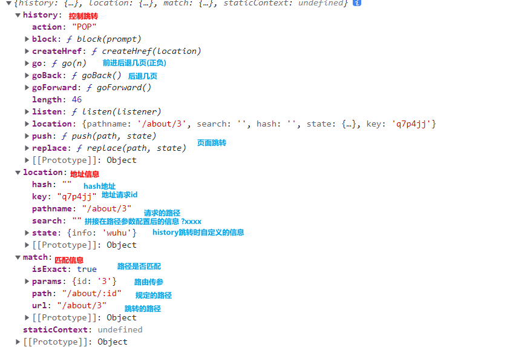

# Router_v5

## 1. 路由配置

### 1.1 创建路由

创建项目后手动安装路由包

`yarn add react-router-dom@5`

注册路由，引入`BrowserRouter` ，设置为根组件

实际开发中，也可以为BrowserRouter起一个别名Router，这样一来我们在切换Router时，只需要修改引用位置，而不需要修改其他代码，

```react
import {BrowserRouter as Router, Link, Route, Switch} from "react-router-dom";
const root = ReactDOM.createRoot(document.getElementById('root'));
root.render(
    <Router>
        <App/>
    </Router>
);
```

将路由和组件进行映射

​            使用Route来映射地址和组件 属性：

1.  path 映射的url地址
2. component 要挂载的组件
3. exact 路径是否完整匹配，默认值false

```react
      <h1>app</h1>
      <Route exact path='/' component={About} />
      <Route exact path='/home' component={Home} />
```

​            当Route的路径被访问，其对应组件就会自动挂载

​              注意 默认情况下Route**并不是严格匹配**

​                只要url地址的头部和path一致，组件就会挂载，不会检查子路径


### 1.2 路由跳转

不要使用a标签

`link`标签跳转

```react
<Link to='/about' >about</Link>
```


`NavLink` 

NavLink和Link作用相似，只是可以指定链接激活后的样式

```react
<NavLink exact activeClassName={clasess.active} to='/about'>about</NavLink>
```


### 1.3 两种路由模式

#### BrowserRouter

当我们通过点击Link构建的链接进行跳转时，跳转并没有经过服务器，所以没有问题

但是当我们刷新页面，或通过普通链接进行跳转时，会向服务器发送请加载数据


这时的请求并没有经过react router

服务器的目录下是没有对应路径的文件的

 所以会返回404


#### HashRouter

通过hash值去寻找地址，可以避免上述问题，

缺点是有个地址栏井号，并且对SEO不友好


**解决:**

还是使用BrowserRouter，但是在服务器做配置，把所有的请求地址都转发到index.html

nginx为例

```nginx
location / {
    root   html;
    #index  index.html index.htm;
    try_files $uri /index.html;
}
```


## 2.  Route组件

**当指定路径被访问,就在页面上挂载对应的组件**


### 2.1 component

接收的是组件的类名，这里没有使用jsx来创建，而是用component创建

通过component会自动创建组件，并且传递参数




#### 2.1.1 路由传递参数

```react
<Route exact path='/about/:id' component={About} />
--about路由--
props.match.params.id
```

每个组件的props都会接收到传递的参数对象


#### 2.1.2 路由跳转

`push()` 切走之后，可回退到push的页面

 `replace`() 替换，切走之后，不能回退到replace的页面

需要一个location对象作为参数

```react
props.history.push({
    pathname: '/about/3',
    state: {
        info: 'wuhu'
    }
})
```

`state` 是自定义信息


###  2.2. render

传递的是组件 通过jsx创建 传递参数就和组件传参一样

​      路由信息可以通过 render的routePros参数传递

```react
<Route exact path='/about/:id' render={(routePros) => {
        return <About info={123} routePros={routePros} />
    }} />
```


### 2.3 children

作用同render一样，可能会简洁一些

这是children最常用的写法

```react
<Route path="/home/:id" children={<Home />} />
```

这样写结构清晰一点

```react
<Route path="/home/:id">
    <Home />
</Route>
```


### 2.4 通过钩子函数获取路由信息

>​    const match = useRouteMatch();
>
>​    const location = useLocation();
>
>​    const history = useHistory();
>
>​    const { id } = useParams();


## 3. 路由嵌套

使用match钩子获取上级路由的地址

` const {path} = useRouteMatch();`

```react
<Route path={`${path}/hello`}>
    <Hello/>
</Route>
```


## 4. 跳转前提示

`Prompt`

```react
<div>
    <Prompt
        when={isPrompt}
        message={"将要离开页面！确认吗？"}/>
    <h2>表单</h2>
    <input
        type="text"
        onChange={e => setIsPrompt(e.target.value.trim().length !== 0)}
        />
</div>
```

when接收一个布尔值控制其展示

比如input的value长度来控制其是否提示跳转(没有输入就不提示)


## 5. 重定向

`redirect`

实现页面跳转 和history类似,默认是replace,也可以切换为push方式

```react
<Redirect push to={"/form"}/>
```


应用场景,

 比如做权限管理,判断没有权限的不让看

```react
<Redirect from={"/abc"} to={"/form"}/>
```

