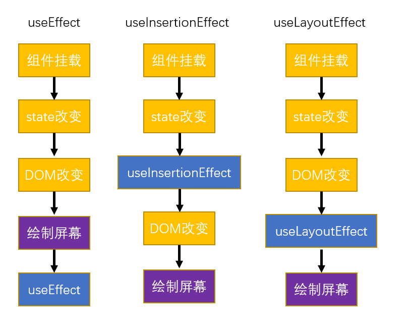

# hook

## 1. useMemo

useMemo 返回的是函数运行的结果， useCallback 返回的是函数。

### 缓存函数结果

```react
    // sum()函数每次组件渲染时都会执行
    //useMemo 用来存储函数的执行结果
    // const result = useMemo(()=>{
    //     return sum(a, b);
    // },[a, b]);
```

### 缓存组件

```react
const someEle = useMemo(()=>{
    return <Some a={a} b={b}/>;
}, [a, b]);
return (
    <div>
        {someEle}
    </div>
)
```


## 2. UseImperativeHandle

### forwardRef

场景:

在其他组件中获取本组件的ref对象

```react
const Some = React.forwardRef((props, ref) => {
    const inputRef = useRef();

    const clickHandler = () => {
        // 点击按钮 获取文本值
        console.log(inputRef.current.value);
    };
    return (
        <div>
            <h2 ref={ref}>Some</h2>
            <input ref={inputRef} type="text"/>
            <button onClick={clickHandler}>Some BTN</button>
        </div>
    );
});

```

其他组件

```react
    useEffect(()=>{

		someRef.current.innerText = 'Some' + count;

    });
    return (
        <div>
            <Some ref={someRef}/>
        </div>


    );
```

这样会造成组件之间的耦合，不方便维护


### UseImperativeHandle

useImperativeHandle 可以用来指定ref返回的值

回调函数的返回值，会成为ref的值

```react
import React, {useImperativeHandle, useRef} from 'react';

/*
*   React.forwardRef()
*       可以用来指定组件向外部暴露的ref
*
* */
const Some = React.forwardRef((props, ref) => {
    const inputRef = useRef();

    const clickHandler = () => {
        // 点击按钮 获取文本值
        console.log(inputRef.current.value);
    };

    // useImperativeHandle 可以用来指定ref返回的值
    useImperativeHandle(ref, ()=>{
        // 回调函数的返回值，会成为ref的值
        return {
            changeInpValue(val){
                inputRef.current.value = val;
            }
        };
    });

    return (
        <div>
            <h2>Some</h2>
            <input ref={inputRef} type="text"/>
            <button onClick={clickHandler}>Some BTN</button>
        </div>
    );
});

export default Some;

```

一般不会返回dom对象，返回的是操作本组件dom对象的方法

其他组件

```react
    useEffect(()=>{
        // console.log(someRef);
        // someRef.current.innerText = 'Some' + count;
        someRef.current.changeInpValue(count);
    });
```

这样，对应本组件的控制权在本组件身上


## 3. 3个effect



### 3.1 useLayoutEffect

useLayoutEffect使用场景不多，实际开发中，在effect中需要修改元素样式，且使用useEffect会出现闪烁现象时可以使用useLayoutEffect进行替换。

### 3.2 useInsertionEffect

**访问不到ref**

用于插入dom元素结构，会比在渲染后插入会效率高一点点