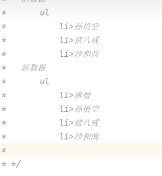

# 虚拟dom

react通过虚拟dom将react元素和原生dom进行映射，操作react就相当于操作了原生的dom

优点:

1. 降低API复杂度

2. 解决兼容问题

3. **提高性能，减少不必要的dom操作**

   > 每当调用react.render(),页面就会重新渲染,
   >
   > react会通过diffing算法对新旧元素进行比较,并只对**变化元素进行更新**
   >
   > react在进行对比时,默认是根据数组中元素排列的顺序进行比较,若是顺序发生了改变就会把所有的dom重新渲染
   >
   > 
   >
   > *此处理应只添加一个唐僧,但结果确实渲染了4次*
   >
   > 所以react需要给每一个数组元素提供一个唯一的key值,重绘时会根据key去对比 `<li key={id}>`
   >
   > 开发中一般使用唯一的id作key,避免使用index