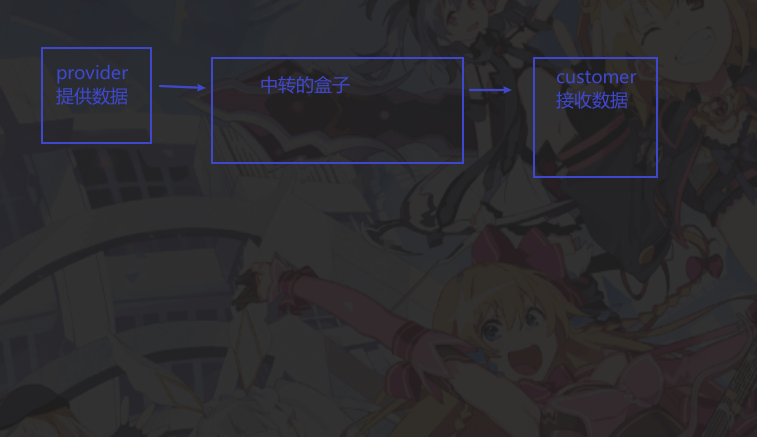

# 组件传参

## 1.父子传参

### 父传子

不能修改props中数据

一层一层从上至下:

爷爷

```js
function App () {
    return (
        <div className="foo">
        <StudyItem desc={'学唢呐'} time={new Date()} />
<StudyItem desc={'学踢球'} time={new Date()} />
</div>
)
}
```

爹

```js
function studyItem (props) {
    return (
        <div className='item'>
        <MyDate />
        <Todo time={props.time} desc={props.desc} />
        </div>
)
}
```

子

```js
function todo (props) {
    console.log(props.time);
    return (
        <div className="todo">
        <div className="do-what">{props.desc}</div>
<div className="time">{props.time.getDate()}</div>
</div>
)

}
```


`props.children`表示组件的所有子节点，在组件内部使用，可以拿到用户在组件中放置的内容

```react
//外层
return <Card className="logs">
    {
        logItemDate
        // logsData.map(item => <LogItem {...item}/> )
    }
</Card>
    --
//内层
function card (props) {
    // 返回标签属性
    console.log(props.children);
    return (
        // 表示接收外部使用card组件传递的className logs
        // {props.children} 表示外部组件的标签内容 logItemDate
        <div className={`card ${props.className}`}>{props.children}</div>
    )
}
```


### 子传父

同vue一样，实际上父传子，传递的是 **函数调用**

子组件拿到函数之后，调用函数，把数据当作参数传入，

父组件拿到参数后就可以存储操作了

父

```react
// 子传父(实际上是父传子，传递的是函数调用)
const updateLogsData = (n) => {
    // n 是子组件传递的参数
    setLogsData([...logsData, { ...n, id: new Date() + '' }])

}

return <div className="app-container">
    <LogsForm updateLogsData={updateLogsData} />
    <Logs logsData={logsData} />
</div>
```

子

```react
// 子父传参
props.updateLogsData(newLog)
```


## 2. context



使用方式有二:

### 2.1 一

> 1.引入context
> *       2.使用 Xxx.Consumer 组件来创建元素
> *       Consumer 的标签体需要一个回调函数
> *       它会将context设置为回调函数的参数，通过参数就可以访问到context中存储的数据


testContext

```react
import React from 'react'

const testContext = React.createContext({
    name: 'zhang3',
    age: 12
})
export default testContext
```

使用的组件

```react


import React from 'react'
import TestContext from '../store/testContext'

function test () {
    return (
        <TestContext.Consumer>
            {(ctx) => {
                return (<div>
                        {ctx.age} -{ctx.name}
                    </div>)
            }}
        </TestContext.Consumer>
    )
}

export default test
```

### 2.2 useContext

>*       1.导入Context
>*       2.使用钩子函数useContext()获取到context
>*       useContext() 需要一个Context作为参数
>*       它会将Context中数据获取并作为返回值返回


```react
const B = () => {

    // 使用钩子函数获取Context
    const ctx = useContext(TestContext);

    return (
        <div>
            {ctx.name} -- {ctx.age}
        </div>
    );
};

```

实际上textContext中不应该保存数据，数据的签发者应该在app.js，即组件的最顶层

可以提供默认的数据，即子组件访问不到provider的数据(比如子组件没写到TextContext中)

```react
import React from 'react'

const testContext = React.createContext({
    //提供默认数据
})
export default testContext
```

app.js  相当于数据的提供者，

test.js 相当于数据的消费者

把需要接收数据的组件写在`TestContext.Provider`标签中，通过`value`来提供共享的数据

```react

return (
    <div>
        <TestContext.Provider value={{ name: 'alex', age: 111 }}>

            <Test />
            <Test2 />
            <Meals meals={mealData}
                onAdd={addMealHandler}
                onDele={deleMealHandler} />
        </TestContext.Provider>
    </div>
);
```


### 2.3 多个provider嵌套

>  当我们通过Context访问数据时，他会读取离他最近的Provider中的数据，
>
>  *       如果没有Provider，则读取Context中的默认数据

```react
<TestContext.Provider value={{name:'猪八戒', age:28}}>
    <A/>

    <TestContext.Provider value={{name:'沙和尚', age:38}} >
        <B/>
    </TestContext.Provider>
```

类似于作用域，就近原则读取value的数据