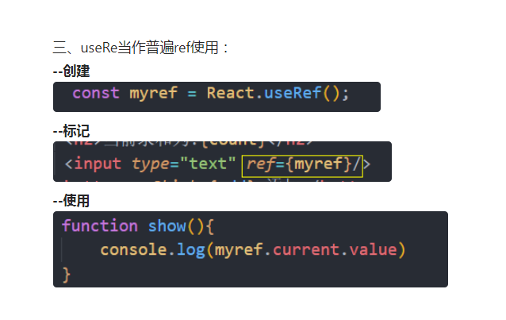

# ref

## 1.使用ref获取dom对象，

`useref()` 钩子函数，创建一个容器，只能用于函数组件或者自定义钩子

只需要将创建的容器作为想要获取对象的`ref`属性即可

```react
const box = useRef()

return <div className={'app'} ref={box}>
    <button onClick={change}>change</button>
</div>;
```

`useRef()`返回的其实是一个对象`{current:undefined}` ,如果仅仅是想要获取dom对象，我们其实可以自己写

```react
const box = {current:undefined}
```

他们的区别在于:

1. 我们自己创建的对象组件每次渲染时都会重新创建一个 **新的对象**
2. 通过`useRef()`创建的对象可以确保组件每次的重渲染获取到的都是 **相同的对象**。


## 2.存储持久的变量

使用`useRef()` 获取的`current`属性，相当于全局变量，该变量的存续时间是整个函数组件的生命周期



