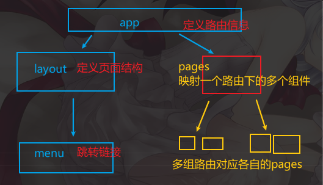

# 权限管理

目录结构




## 1. 登录成功后存储到redux

1. 成功标识
2. token
3. 用户信息
4. 重定向


## 2. 路由权限

判断状态是否为登录，并把这个功能抽离为组件

```react
const NeedAuth = props => {
    const auth = useSelector(state => state.auth);
    const location = useLocation();


    return auth.isLogged ?
        props.children :
        <Navigate
            to={"/auth-form"}
            replace
            state={{preLocation: location}}
            />;
};
```

在需要权限判断的组件上包裹这个组件即可

```react
const App = () => {
    const auth = useSelector(state => state.auth);

    return (
        <Layout>
            <Routes>
                <Route path={"/"} element={<HomePage/>}/>
                <Route path={"profile"} element={<NeedAuth><ProfilePage/></NeedAuth>}/>
                <Route path={"auth-form"} element={<AuthPage/>}/>
            </Routes>
        </Layout>
    );
};
```

这里表示，当保存的权限状态为真时，就渲染作为参数传递过来的`ProfilePage`，不然就页面重定向到之前跳转来的页面

这个页面地址通过`useLocation`钩子获取，并且通过state传递到接下来要访问的页面中

```react

const navigate = useNavigate();
const location = useLocation();

const from = location.state?.preLocation?.pathname || "/";
```

from为 可选链式编程，因为location.state可能为空(不是从权限判断的组件跳转来的，就没有携带state)

没有的话就赋值为 `/`

在重定向到之前的页面(或者通过`/`跳回主页)

```react
 navigate(from, {replace:true});
```


## 3. 数据持久化

存到localstorage

记得stringify

并且数据初始化，记得从本地拿 

RTKQ

```react
initialState: () => {
    const token = localStorage.getItem('token');

    if(!token){
        return {
            isLogged: false,
            token: null, // 服务器发送给我们的token默认有效期为1个月
            user: null
        };
    }

    return {
        isLogged: true,
        token,
        user: JSON.parse(localStorage.getItem('user'))
    };

},
```

## 


## 4. 自动登出 token失效

### 4.1 在登录时保存登录时间信息

获取登录时间戳，并设置失效时长，计算后得到失效时间戳日期，把他们保存到本地

RTKQ

`initialState` 可以接收函数作为参数，函数返回值就是它的值(这样就可以在initialState中 写逻辑了)

```react
initialState: () => {
    const token = localStorage.getItem('token');

    if (!token) {
        return {
            isLogged: false,
            token: null, // 服务器发送给我们的token默认有效期为1个月
            user: null,
            expirationTime: 0 // 登录状态失效时间
        };
    }

    return {
        isLogged: true,
        token,
        user: JSON.parse(localStorage.getItem('user')),
        expirationTime: +localStorage.getItem('expirationTime')
    };

},
```

reducer

设置对应函数的失效日期

```react
reducers: {
        login(state, action) {
            state.isLogged = true;
            state.token = action.payload.token;
            state.user = action.payload.user;
            // 获取当前时间戳
            const currentTime = Date.now();
            // 设置登录的有效时间
            const timeout = 1000 * 60 * 60 * 24 * 7; // 一周
            // const timeout = 10000 // 10s

            state.expirationTime = currentTime + timeout; // 设置失效日期

            // 将数据同时存储到本地存储中
            localStorage.setItem('token', state.token);
            localStorage.setItem('user', JSON.stringify(state.user));
            localStorage.setItem("expirationTime", state.expirationTime + "");
        },
}
```


### 4.2 主文件 app.js设置检查

获取当前时间戳，比对本地存储的失效时间戳日期，看是否调用登出函数(清空本地信息并跳转页面)

app中不应该涉及太多逻辑，把他提取成自定义钩子函数然后引入

```react
import {useDispatch, useSelector} from "react-redux";
import {useEffect} from "react";
import {logout} from "../store/reducer/authSlice";

const useAutoLogout = () => {
    const auth = useSelector(state => state.auth);
    const dispatch = useDispatch();

    // 创建一个useEffect，用来处理登录状态
    useEffect(() => {
        const timeout = auth.expirationTime - Date.now();
        // 判断timeout的值
        if (timeout < 6000) {
            dispatch(logout());
            return;
        }
        const timer = setTimeout(() => {
            dispatch(logout());
        }, timeout);

        return () => {
            clearTimeout(timer);
        };
    }, [auth]);
};

export default useAutoLogout;

```

app中 `useAutoLogout()`


## 5. 设置请求头

权限接口需要权限请求头

RTKQ

```react
baseQuery: fetchBaseQuery({
    baseUrl: "http://localhost:1337/api/",
    prepareHeaders:(headers, {getState})=>{
        // 获取用户的token
        const token = getState().auth.token;
        if(token){
            headers.set("Authorization", `Bearer ${token}`);
        }
        return headers;
    } // 用来统一设置请求头

}),// 指定查询的基础信息，发送请求使用的工具
```

`prepareHeaders`设置请求头，接收的第二个参数是回调函数，函数的参数包含了各种信息，

其中`getState`提供保存在redux中的state信息，就可以获取到最新的从服务器返回的token