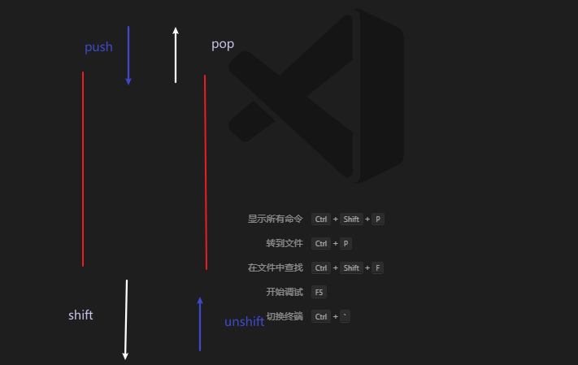

## 数组

数组的存储性能比对象好，常用数组

### 1.方法

1. 回调函数(由我们创建，但自动调用)

   1. `forEach(item)`

2. `slice(start,end)`返回数组中选定范围的元素

   

3. find(fn) 接受一个函数，返回通过了该函数条件的第一个数组元素(后面即使还有符合条件的也不会返回)，没有就返回undefined

   实例，返回符合大于输入框中数字的数组索引值：

   ```js
   var ages = [4, 12, 16, 20];
    
   function checkAdult(age) {
       return age >= document.getElementById("ageToCheck").value;
   }
    
   function myFunction() {
       document.getElementById("demo").innerHTML = ages.find(checkAdult);
   }
   ```

     

4. 


### 2.高级函数

1. `forEach`
2. `filter`
3. `map`
4. `some`
5. `every`
6. `reduce`


```js
let a = ["alex", "bob", "zhang3", "bob", "bob", "alex"];
let aa = [2, 38, 2, 1, 0, 2];
let b = [];

//forEach 遍历，无返回值
a.forEach((item) => {
    b.unshift(item);
});

let a1 = a.forEach((item) => {
    item++;
}); //undefined 不返回值

//map 遍历，操作每一项，返回操作后的新数组
let a3 = a.map((item) => {
    return item * 2;
});

//filter 遍历，返回函数过滤后的项组成的新数组
let a2 = a.filter((item) => {
    return item > 2;
});

//some 遍历每一项，只要有一个符合函数判断，就返回true
let a4 = a.some((item) => {
    return item > 2;
});

//every 遍历每一项，必须全部符合函数判断，才返回true
let a5 = a.every((item) => {
    return item > 2;
});

//reduce
/**
 * pre,上一项
 *  curr, 当前项
 * index,当前索引
 *  arr累加数组
 * 函数后的 initalvalue,第一次累加时，在第一项之前的第0个值，一般为0
 *
 */

let a7 = aa.reduce((pre, curr, index, arr) => {
    return pre + curr;
}, 0);
//编程式跳转，可以写在任意标签上
    toRefundHistory() {
      //这是简写
      this.$router.push("./RefundHistory");
    },
    sys(){
      this.$router.push('/index')
    },
    role(){
      this.$router.push('/role')
    },
    title(){
      this.$router.push('/title')
    },
    updatepw(){
      this.$router.push('/updatepw')
    }

```


