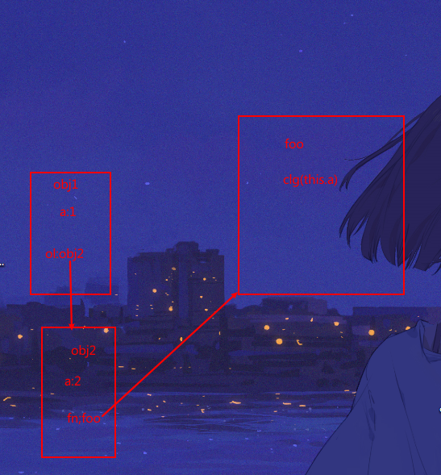
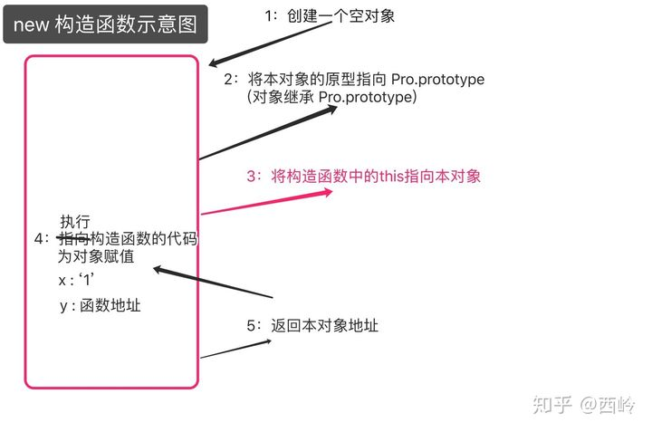

## this指向

#### 1.全局

`this => window`

#### 2.普通函数

指向调用者

`obj1`对象的`o1`属性值是`obj2`对象的地址，而`obj2`对象的`fn`属性的值是函数`foo`的地址；

函数`foo`的调用环境是在`obj2`中的，因此`this`指向对象`obj2`;

```js
function foo() {
    console.log(this.a);
}
var obj2 = {
    a: 2,
    fn: foo
};
var obj1 = {
    a: 1,
    o1: obj2
};
obj1.o1.fn(); // 2
```



#### 3.箭头函数

对于普通函数来说，内部的`this`指向函数运行时所在的对象，但是这一点对箭头函数不成立。它没有自己的`this`对象，**内部的`this`就是定义时上层作用域中的`this`。**也就是说，箭头函数内部的`this`指向是**固定的**，相比之下，普通函数的`this`指向是可变的。

```js
var div = document.querySelector('div'); 
    var o={
        a:function(){
            var arr=[1];
          //就是定义所在对象中的this
          //这里的this—>o
            arr.forEach(item=>{
              //所以this -> o
                console.log(this);
            })
        },
      //这里的this指向window o是定义在window中的对象
        b:()=>{
            console.log(this);
        },
        c:function() {
            console.log(this);
        }
    }
    div.addEventListener('click',item=>{
        console.log(this);//this->window 这里的this就是定义上文window环境中的this
    });
    o.a(); //this->o
    o.b();//this->window
    o.c();//this->o 普通函数谁调用就指向谁
```


#### 4.事件绑定

事件绑定共有三种方式：行内绑定、动态绑定、事件监听；

1. 行内绑定 也分两者：

   ```js
   <input type="button" value="按钮" onclick="clickFun()">
   <script>
       function clickFun(){
           this // 此函数的运行环境在全局window对象下，因此this指向window;
       }
   </script>
   
   <input type="button" value="按钮" onclick="this">
   <!-- 运行环境在节点对象中，因此this指向本节点对象 -->
   ```

   行内绑定事件的语法是在html节点内，以节点属性的方式绑定，属性名是事件名称前面加'on'，属性的值则是一段可执行的 JS 代码段；而属性值最常见的就是一个函数调用；

   当事件触发时，属性值就会作为JS代码被执行，当前运行环境下没有`clickFun`函数，因此浏览器就需要跳出当前运行环境，在整个环境中寻找一个叫`clickFun`的函数并执行这个函数，所以函数内部的this就指向了全局对象window；如果不是一个函数调用，直接在当前节点对象环境下使用this，那么显然this就会指向当前节点对象；

2. 动态绑定与事件监听：两者相同

   ```js
   <input type="button" value="按钮" id="btn">
   <script>
       var btn = document.getElementById('btn');
       btn.onclick = function(){
           this ;  // this指向本节点对象
       }
   </script>
   ```

   因为动态绑定的事件本就是为节点对象的属性(事件名称前面加'on')重新赋值为一个匿名函数，因此函数在执行时就是在节点对象的环境下，this自然就指向了本节点对象；

   事件监听中this指向的原理与动态绑定基本一致，


#### 5.定时器

```js
var obj = {
    fun:function(){
        this ;
    }
}
​
setInterval(obj.fun,1000);      // this指向window对象
setInterval('obj.fun()',1000);  // this指向obj对象
```

`setInterval()` 是window对象下内置的一个方法，接受两个参数，第一个参数允许是一个函数或者是一段可执行的 JS 代码，第二个参数则是执行前面函数或者代码的时间间隔；

在上面的代码中，`setInterval(obj.fun,1000)` 的第一个参数是`obj`对象的`fun` ，因为 JS 中函数可以被当做值来做引用传递，**实际就是将这个函数的地址当做参数传递给了 `setInterval` 方法**，换句话说就是 `setInterval` 的第一参数接受了一个函数，那么此时1000毫秒后，**函数的运行就已经是在window对象下了**，也就是函数的调用者已经变成了window对象，所以其中的this则指向的全局window对象；

而在 `setInterval('obj.fun()',1000)` 中的第一个参数，实际则是传入的一段可执行的 JS 代码；1000毫秒后当 JS 引擎来执行这段代码时，则是通过 `obj` 对象来找到 `fun` 函数并调用执行，那么函数的运行环境依然在 对象 `obj` 内，所以函数内部的this也就指向了 `obj` 对象；

#### 6.构造函数

new关键字后，创建对象的内部操作步骤:



```js
var obj = new CO()
//第一行，创建一个空对象obj。
var obj  ={};
//第二行，将这个空对象的__proto__成员指向了构造函数对象的prototype成员对象.
obj.__proto__ = CO.prototype;
//第三行，将构造函数的作用域赋给新对象，因此CA函数中的this指向新对象obj，然后再调用CO函数。于是我们就给obj对象赋值了一个成员变量p，这个成员变量的值是” I’min constructed object”。
CO.call(obj);
//第四行，返回新对象obj。
return obj;
```

new关键字会将构造函数中的this指向实例化对象，所以构造函数中的this->实例化对象