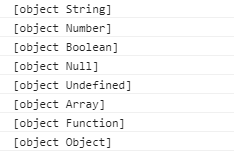

### 杂项

1. `session` 判断转换成布尔值

   这里`setItem` 拿到的永远是`string`，要转换一下，通过强制对比解决

   ```js
   sessionStorage.setItem("isLogin", true);
                   let isLogin =
                       sessionStorage.getItem("isLogin") ===
                       "true"
                           ? Boolean(true)
                           : Boolean(false);
   ```

   或者，先`JSON.stringify()`存储为json字符串，然后再`JSON.parse()`转换回来

2. `！！('true')`

   非空字符串先取反变成`false`  ，再取反就是`true`

3. `Object.keys` 对象变为数组

4. `javascript:;` 防止默认事件

5. `('属性' in obj)`检测对象中是否含有某个属性，就算该对象中没有，但它的**原型**中有，也会返回`true`

6. `obj.hasOwnProperty(attr)`检测对象中**自身**是否含有该属性

7. `stop.Propagation`阻止事件冒泡

8. `arguments.callee`返回拥有此`arguments`对象的函数

9. `fn.caller` 返回调用此函数`fn`的对象，若在`window`下调用，则返回`null`

   1. `arguments.callee.caller`返回同上的结果

10. `Date.now()`获取当前代码执行的时间戳

   11. ```js
       设置一个秒表：必须命名可设置多个秒表
       console.time('a')
       //要计算的执行时间代码写到中间
       console.timeEnd('a')
        //例子
          console.time('abc');
          for (var i = 0; i < 100000000; i++) {};
          console.timeEnd('abc');
       ```

12. `Math`和其他对象不一样，不是一个构造函数，只是一个封装了数学相关方法和属性的**类**

13. `slice(n,m)`返回包含索引区间的新数组，不包含m

14. `splice(index,n,item...)`在指定位置index,删除(并添加item，),**改变原数组**

    1. 不添加，n为0
    2. 要删除几个，n为几
    3. 删除item有返回值，值就是删除的内容，存放在数组中

15. `!!`把非布尔值转换为布尔值

16. `className += ' x'`在新类名前加空格，可用累加之前的样式

17. `addEventListener`绑定带参数的函数

    ```js
    btn.addEventListener(
                    "click",
                    function () {
                        addClass(div, "a2");
                    }
                );
    ```

18. `arr.includes(n)`数组arr是否包含n

19. `getElement`获取动态节点(动态添加的)，`querySelector`获取静态节点

20. `n = n || 10` n被强行转为布尔值，如果为true，就把n赋值给n,不是的话就赋值10

21. `for (k of xx)` 循环遍历任何数据类型的 获取键值(对象除外)

22. `for(k in xx)` 循环遍历对象，只能获取键名

23. 存储

    1. `localStorage` 存活时间是永久
    2. `sessionStorage` 存活时间是浏览器当前标签

24. 解决 vscode 注释失效 

    ```js
    //#region
    code---
    //#endregion   
    ```

25. `sort()`排序

    ```js
    arr.sort((a,b) => {
        return a-b //升序
        return b-a //降序
    })
    ```

26. 对象中的函数名简写

    当作为属性的函数名，名称为驼峰写法时，应该用 '' 包裹，因为属性名本来就是一个字符串，平时只是简写

    ```js
    obj= {
        fn(){
            
        }
        -----
        'reallyLike':function(){
            
        }
    }
    ```

27. call apply bind 都是改变函数执行时的作用域，区别如下

    1. call bind 接收第二个值是参数项，apply是数组
    2. call apply是立即执行，bind是返回一个函数调用，可以用一个变量接收，以后再用

28. 字符串

    1. str.startWith('字符') 		
    2. str.endWith('字符')
    3. includes('字符串') 返回boolean

29. 重复字符串

    str.repeat(重复几次)

30. 补充字符串

    str.padStart(最大长度,'补充的字符')

    ```js
    let str = 'alex'
    str.padStart(5,'J')
    //Jalex
    ```

31. 全能的数据类型检测

    Object.prototype.toString.call()

    ```js
     1 var a = Object.prototype.toString;
     2 
     3 console.log(a.call("aaa"));
     4 console.log(a.call(1));
     5 console.log(a.call(true));
     6 console.log(a.call(null));
     7 console.log(a.call(undefined));
     8 console.log(a.call([]));
     9 console.log(a.call(function() {}));
    10 console.log(a.call({}));
    ```

    


