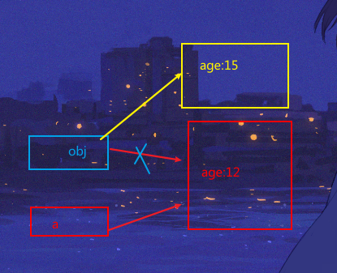

## 数据_变量

 **赋值**

- 对象赋值是给别人，自己在堆中的地址，
- 基本数据赋值是给别人 ，自己的数据的拷贝，而自己的数据有两种，一种是基本数据，一种是地址值数据(之前被对象赋值了)

**引用变量的赋值问题**

- 两个引用变量指向同一个对象，通过一个变量修改对象内部的数据，另一个变量看到的是修改后的对象的数据。

  因为第一个变量中保存的是对象的地址，而第二个变量保存的是第一个变量的数据，这个数据正好是对象的地址

- 两个引用变量指向同一个对象，其中一个变量指向了另一个对象，第二个变量依然指向原来的对象

  - 

    ```js
    var a = {age:12}
    function fn (obj){
        obj = {age: 15}
    }
    fn(a)
    console.log(a.age) //12
    //传递给形参obj的确实是a保存的地址值，但obj在内部被重写来，重新创建了一个对象{age：15}，并指向它，obj现在和{age:12}没有关系
    ```

    

- js函数调用时，传给形参的  传的都是值(基本值/地址值，视传递过去实参的不同而不同)

**内存释放**

函数内部创建了一个对象的变量，当函数结束时，变量占用的内存空间立即释放。但变量指向的对象要在之后由垃圾回收机制自动回收(时间差很小，但有区别)

```js
function foo (){
    let b ={}
}
foo()
```


 