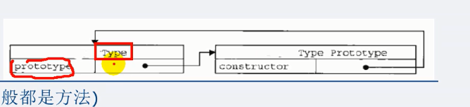
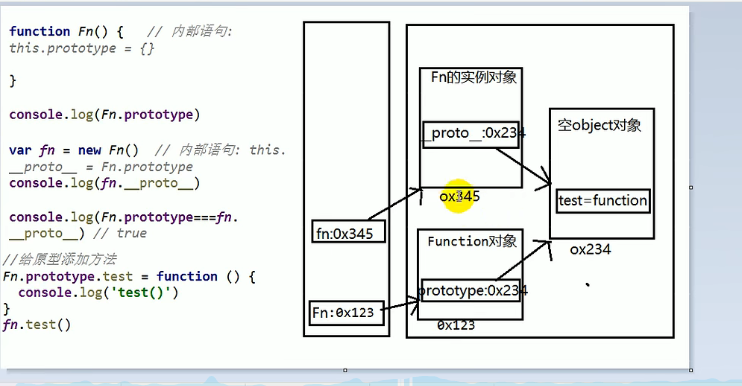
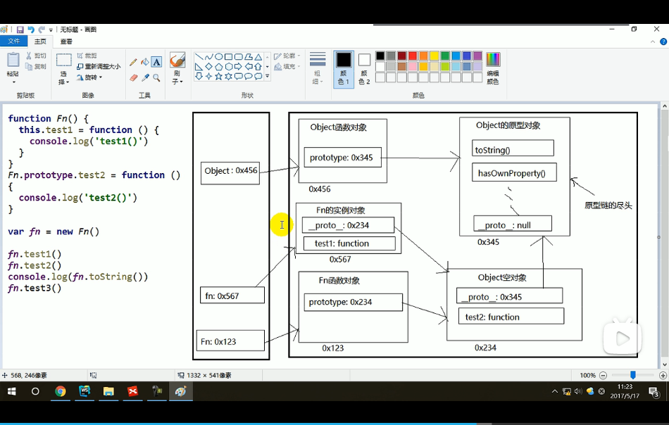
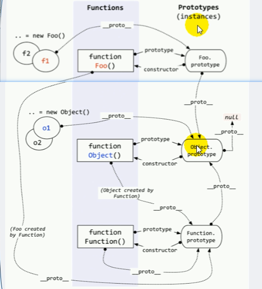

# 原型

每个函数都有一个`prototype`属性，默认指向原型对象（Object空对象,空是指：刚开始没有我们定义的属性方法）

构造函数的实例对象的`__proto__`属性指向原型对象（和其构造函数指向相同）


而原型对象中有个`constructor`属性指向`prototype` **所在**的函数对象,即`Type.prototype.constructor`=>`Type`




**显式属性，隐式属性**

- 每个函数都有个`prototype`属性，在定义函数的时候添加
  - 每个函数都有`__porto__`属性，指向`Function`的`prototype`
- 每个实例对象都有个`__proto__`属性，在创建实例对象时添加
- 两者相等

创造实例对象时相当于创建了如下

```js
let fn = new Fn()
//this.__proto__ = Fn.prototype 
```

创建构造函数时相当于创建了如下

```js
function Fn () {
    //this.prototype = {}
}
```

**构造函数的显式原型对象(prototype)，等于，其实例对象的隐式原型对象( \__proto__ )**

```js
function Foo() {}
let bar = new Foo()
console.log(bar.__proto__)
console.dir(Foo.prototype)
console.dir(Foo.prototype === bar.__proto__) // true
```


## **原型图**




## 原型链

一般的，我们只操作显式原型`prototype`


访问一个对象的属性时，先在自身查找，再沿着`__proto__`向上查找，直到`Object`，所以原型链也叫 **隐式原型链** 

一直查找，直到`Object.prototype.__proto__`,值为`null`




```js
function Foo() {
                this.test = function () {
                    console.log(1);
                };
            }
            Foo.prototype.test2 = function () {
                console.log(2);
            };
            let fn = new Foo();

            console.log(
                Object.prototype === Foo.prototype.__proto__
            );//true
```


**实际上每个函数都有`prototype`， `__proto__`属性，意即所有函数都有个`__proto__`属性，指向`Function`的`prototype`属性**

<u>可用推导出，所有函数的`__proto__`都相等</u>

```js
function Foo() {}
let Bar = new Function();
function ab(params) {}
console.log(ab.__proto__ === Bar.__proto__); //true
console.log(ab.__proto__ === Foo.__proto__); //true
```


因为所有函数都是通过` new Funciton` 创建的， 包括`Funciotn`本身

```js
let Foo = new Function();
//
Function = new Function();
```


**`Object`构造函数对象也是`Function`构造函数的实例对象**

```js
console.log(
                Object.__proto__ === Function.prototype
            ); //true
```

<u>对于开头的定义“每个函数都有一个`prototype`属性，默认指向原型对象”在这里有别，`Object`不适用此说法(Object也是Function创建的函数)</u>

```js
let fn = new Fn();
            function Fn(params) {}
            console.log(Fn.prototype instanceof Object);//true
            console.log(Object.prototype instanceof Object);//true
            console.log(
                Function.prototype instanceof Object
            );//true
```

## Issue

1. 读取对象属性的时候会在原型链中查找，但设置时不会。如果当前对象中没此属性就直接添加到当前对象下面，不管原型上有没有同名的属性

   <u>所以我们不在原型上添加属性</u>


## instanceof

`a instanceof b`  一般地，a为实例对象 ，b为构造函数

如果b函数的显式原型对象(prototype)在a对象的原型链(`__proto__`)上，就返回true ，否则返回false




```js
			console.log(Object instanceof Function);//true
            console.log(Object instanceof Object);//true
            console.log(Function instanceof Function);//true
            console.log(Function instanceof Object);//true

            console.log(Object instanceof foo);//false
```

## 题

1. ```js
       function A() {}
       A.prototype.n = 1;
    
       let b = new A();
       A.prototype = {
           n: 2,
           m: 3,
       };
    
       let c = new A();
       console.log(b.n, b.m, c.n, c.m); //1 undefined 2 3
   ```

   

   > 实例对象b. \__proto__ 确实指向**原来**构造函数A的prototype -> Object
   >
   > 但是A.prototype = {}，相当于覆写了A的原型指向，所以之后再基于A创建的实例，就访问不到原来定义在A原型上的属性 n 了

2. ```js
   function F() {}
              Object.prototype.a = function () {
                  console.log("a");
              };
              Function.prototype.b = function () {
                  console.log("b");
              };
              let f = new F();
     
              f.a(); //a
              f.b(); //error
              F.a(); //a
              F.b(); //b
   ```

   