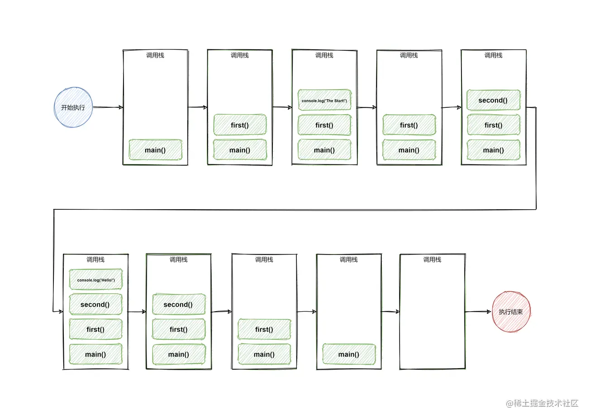

## 执行上下文

**调用才会产生上下文，（光定义不会**

用`var` 声明的变量相当于先定义，再赋值

函数也同理，在之前就可用调用

```js
console.log(a)//undefined
var a = 4
​``````相当于
var a
log(a)
a = 4
```


**先执行变量提升，再执行函数提升**


```js
function a () {}
var a
console.log(typeof a) // function
```


#### 全局执行确定为全局上下文

在执行全局代码前将window 确定为全局上下文，

对全局数据进行预处理

1. `var`定义的全局变量 =>undefined，添加为`window`的属性
2. `function`声明的全局函数=>赋值(fun)，添加为`window`方法
3. `this`=>赋值(window)


### 函数执行上下文

在调用函数，准备执行函数体之前，创建对应的函数执行上下文对象(把某个函数的所有参数，局部变量，放在栈中的某一块区域)

对局部数据预处理

1. 实参赋值给形参，添加为执行上下文的属性
2. `arguments`赋值，添加为执行上下文的属性
3. `var function`同上
4. `this`赋值为调用函数的对象   


**执行栈**


1. 在 **全局代码** 执行前，js会创建一个栈来存储所有的执行上下文对象
2. 先压入`window`，栈底
3. 在函数执行上下文创建后，压入
4. 当前函数执行完成后，先将其移除，再压入下一个函数（如果有的话

```js
const second = () => {
  console.log('Hello!')
}

const first = () => {
  console.log('The Start!')
  second()
  console.log('The End!')
}

first()

```





### test：

#### 1.

```js
    console.log("a" + i);
                var i = 1;
                var i2 = 1;
                foo(1);
                function foo(i) {
                    if (i == 4) {
                        return;
                    }
                    console.log("b" + i);
                    foo(i + 1);
                    console.log("c" + i);
                    console.log(i2++);
                }
                console.log("d" + i);
                console.log(i2);
```


#### 2.

```js
var c = 1;
            function c(c) {
                console.log(c);
            }
            c(2); //报错 c is not a function
```

变量先于函数提升，相当于如下执行顺序：

```js
var c 
            function c(c) {
                console.log(c);
            }
c = 1;
            c(2); //报错 c is not a function
```

#### 3.

```js
if(!(b in window)){
    var b = 1
}
console.log(b)//undefined
//var b 现在全局定义，赋值操作在if中执行(如果可用执行的话)，此处if判断为！true，所以不会给b赋值
```

