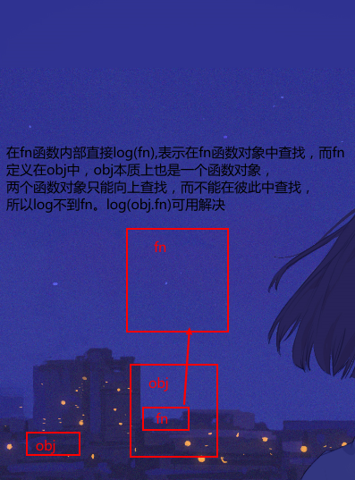

## 作用域

用于隔离变量，

<u>函数作用域链在**定义**函数时创建，函数执行上下文在**调用**时产生</u>

1. 定义函数时会创建一个包含**全局对象**的作用域链，这个作用域链会被保存在`[[Scope]]`属性汇中
2. 当函数被调用时，会创建一个执行上下文
3. 此后有个**活动对象**(当前函数保存的变量，包括，arguments,this,自定义变量等)被创建，并被推到作用域的最前端
4. 作用域本质上是一个由**作用域链中的对象**指向变量对象的**指针列表**


嵌套向上冒泡查找需要的数据，但

作用域是**静态的**，不会因为在其他函数中执行而改变作用域的位置

```js
  var a = 10;
            function fn() {
                console.log(a);
            }
            function boo(params) {
                var a = 20;
                params();
            }
            boo(fn); //10
```

查找是**向上**的，不会向下

`obj.fn();`是处于全局作用域

```js
 var obj = {
                fn: function () {
                    console.log(fn);//error
                    //console.log(this.fn);
                },
            };
            obj.fn();
```


###  text:

```js
var foo = {
    a: 3,
};
var obj = {
    fn: function () {
        console.log(foo.a);
        console.log(this.fn);
        console.log(fn);
    },
};
obj.fn();
```

```js
//打印
3
test.html:34 ƒ () {
                    console.log(foo.a);
                    console.log(this.fn);
                    console.log(fn);
                }
test.html:35 Uncaught ReferenceError: fn is not defined
    at Object.fn (test.html:35:33)
    at test.html:38:17
```

