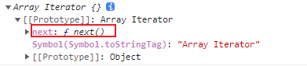
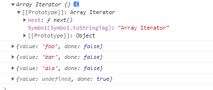

## 迭代器

迭代器(iterator)是一种接口，部署了iterator接口的数据结构，就可以完成遍历的操作

原生具备iterator接口的数据如下：

1. Array
2. Arguments
3. Set
4. Map
5. String
6. TypedArray
7. NodeList


工作原理：

1. 创建一个指针对象(xxx.[Symbol.iterator])，指向当前数据结构的起始位置

   

2. 第一次调用对象的next方法，指针自动指向数据结构的第一个成员

3. 接下来不停的调用next方法，指针一直向后移动，直到最后一个成员

4. 每次调用next方法，都会返回一个包含value和done属性的对象

```js
const arr = ["foo", "bar", "ala"];
let iterator = arr[Symbol.iterator]();
console.log(iterator);
console.log(iterator.next());
console.log(iterator.next());
console.log(iterator.next());
console.log(iterator.next());
```




应用：

自定义遍历数组

需求：

 遍历对象中(原生中没有部署iterator接口)，一个数组属性的中的值

```js
const banji = {
    name: "2班",
    stus: ["foo", "bar", "zhang3"],
    [Symbol.iterator]: function () {
        let index = 0;
        return {
            next: () => {
                if (index <= this.stus.length) {
                    const res = { value: this.stus[index], done: false };
                    index++;
                    return res;
                } else {
                    const res = { value: undefined, done: true };
                    return res;
                }
            },
        };
    },
};
for (const v of banji) {
    console.log(v);
}
```

