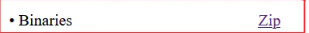
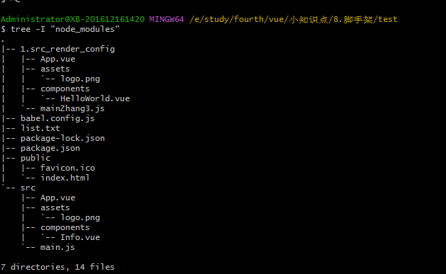

## 输出tree结构

下载 

[](http://gnuwin32.sourceforge.net/packages/tree.htm) 下载 Binaries

把bin/tree.exe 复制到git的\Git\usr\bin文件夹下



进入目标文件夹打开终端：

1. 输出目录结构到txt：tree /f > list.txt

2. 忽略某个文件：tree -I “node_modules“

   

3. 忽略多个文件：tree -I “node_modules|pages|page_*”


```js
  -a            All files are listed.
  -d            List directories only.
  -l            Follow symbolic links like directories.
  -f            Print the full path prefix for each file.
  -i            Don't print indentation lines.
  -q            Print non-printable characters as '?'.
  -N            Print non-printable characters as is.
  -p            Print the protections for each file.
  -u            Displays file owner or UID number.
  -g            Displays file group owner or GID number.
  -s            Print the size in bytes of each file.
  -h            Print the size in a more human readable way.
  -D            Print the date of last modification.
  -F            Appends '/', '=', '*', or '|' as per ls -F.
  -v            Sort files alphanumerically by version.
  -r            Sort files in reverse alphanumeric order.
  -t            Sort files by last modification time.
  -x            Stay on current filesystem only.
  -L level      Descend only level directories deep.
  -A            Print ANSI lines graphic indentation lines.
  -S            Print with ASCII graphics indentation lines.
  -n            Turn colorization off always (-C overrides).
  -C            Turn colorization on always.
  -P pattern    List only those files that match the pattern given.
  -I pattern    Do not list files that match the given pattern.
  -H baseHREF   Prints out HTML format with baseHREF as top directory.
  -T string     Replace the default HTML title and H1 header with string.
  -R            Rerun tree when max dir level reached.
  -o file       Output to file instead of stdout.
  --inodes      Print inode number of each file.
  --device      Print device ID number to which each file belongs.
  --noreport    Turn off file/directory count at end of tree listing.
  --nolinks     Turn off hyperlinks in HTML output.
  --dirsfirst   List directories before files.
  --charset X   Use charset X for HTML and indentation line output.
  --filelimit # Do not descend dirs with more than # files in them.

```

