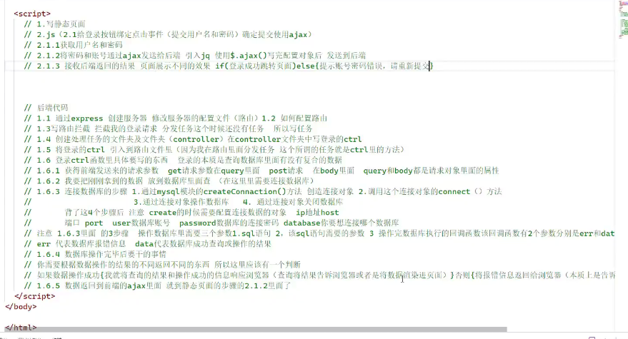
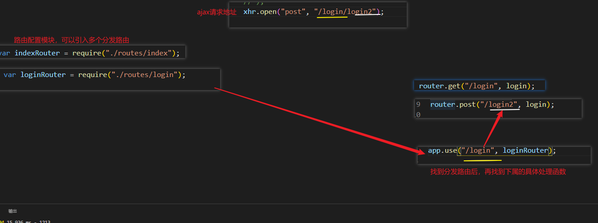
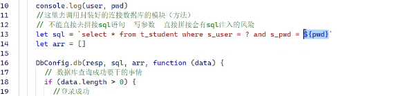
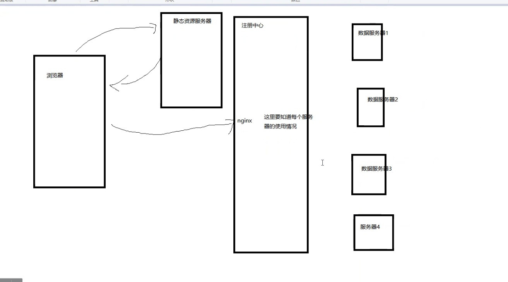
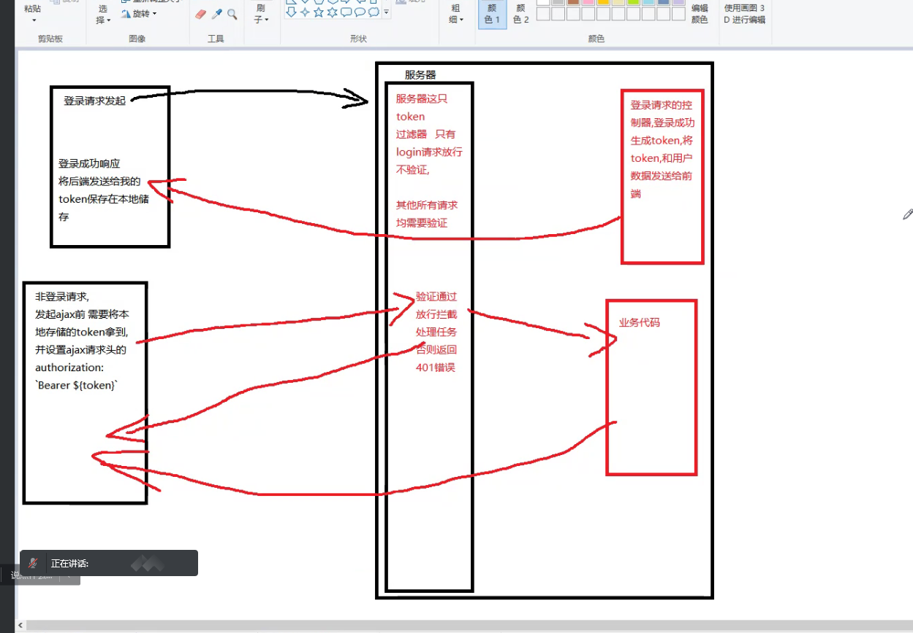
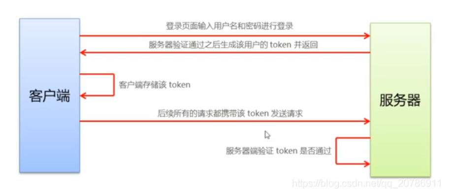

## 登录注册

#### 1.步骤



**路由拼接：**




#### 2.sql注入

不能直接去拼接语句，需要写参数



所以，这里应该用`？`占位符


#### 3.后台处理并发数据



#### 4.token

<u>jsonwebtoken  是生成token的模块   express-jwt 是验证的模块</u>

` npm i express-jwt -s`

` npm i jsonwebtoken -s`

除了登录请求，其他的所有请求都需要`token`验证

**jwt:**

模块，处理密钥验证

*一次请求，只能有一次响应*


**流程图解：**






##### 1.在登录的路由处理函数中。根据，获取的账户，密码，生成token，返还给前端，保存

`const jwt = require("jsonwebtoken");`

登录成功后，调用 `jwt.sign()` 方法生成 JWT 字符串。

并通过 `token `属性发送给客户端

sign()包含：1.加密的字段 2.自定义的密钥 3.生存周期

```js
//此处生成密钥，并返回按给前端
                let token = jwt.sign(
                    {
                        stuName: data[0].u_name,
                        userName: data[0].u_class,
                    },
                    "miyao",
                    {
                        expiresIn: "0.5h",
                    }
                );
res.send({
                    code: 200,
                    msg: "登录成功",
                    data,
                    token,
                });

```


##### 2.注册将 JWT 字符串解析还原成 JSON 对象的中间件

app.use()  

`const jwt = require("express-jwt");`

token配置在路由分发前

```js
app.use(
    jwt({
        secret:'sdadda',//随便写
        algorithms: ['HS256'],
    }).unless({
        //配置哪些东西不需要token验证
        path:["/login/login2"],
    })
);
```


##### 3.登录的ajax处，前端保存token

```js
success(data) {
                        if (data.code === 200) {
                            console.log(" success");
                            console.log(data);
                            //保存token
                            console.log(data.token);
                            sessionStorage.setItem(
                                "token",
                                data.token
                            );

                            // location.href = "./index.html";
                        }
                    },
```

##### 4.非登录页面(即，需要token的页面)，在发起ajax请求的时候需要设置携带了token 的请求头

**获取：**

```js
//获取请求头
                //此处bearer 要空格
                let token = sessionStorage.getItem("token");
```

**ajax中设置：**

```js

//携带token请求头
                xhr.setRequestHeader(
                    "authorization",
                    `Bearer ${token}`
                );
```


