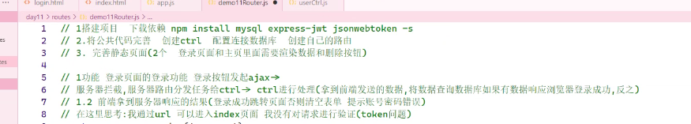
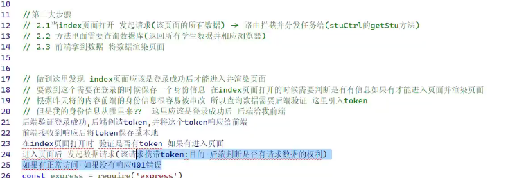
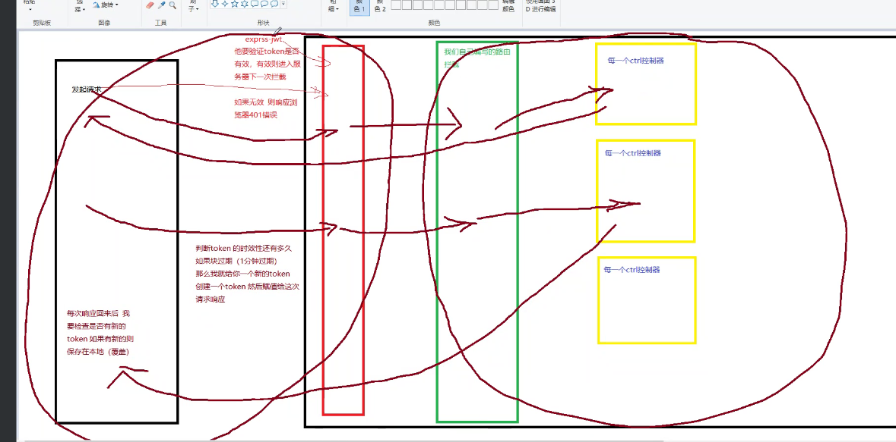

### 1.本日流程步骤

#### 1



#### 2



#### 3




### 2.路由分发

**一级：**

拦截所有api开头的请求

```js
app.use('/\^api',routerApi)
```

**二级：**

路由处理的函数地址

```js
router.get('/login',login)
```


**前端请求的地址：**

`/api/login`


### 3.token的应用流程

#### 3.1签发token

登录成功签发token =〉send携带，返还给前端

```js
let token = jwt.sign({信息},"密钥",{expiresIn:'时间'})
```

```js
res.send({
    data,
    token
})
```


#### 3.2前端接受token

存储到本地

```js
sessionStorage.setItem('token',token)
```


#### 3.3打开页面时验证token

有才能进入，不然就返回login页面


#### 3.4进入页面后，发送都需要携带token

token在请求头中设置


#### 3.5后端接收请求，验证token

`npm i express- jwt`

app.js中，写在路由分发前

```js
app.use(express-jwt({
    '密钥',algorithms:['HS256']
}).unless({
    path:['/不需要验证token的接口']
}))
```


#### 3.6token过期

判断，过期就返回login页面

```js
$.ajax({
    error(err){
        if(err.status == 401){
            //过期了
        }
    }
})
```


#### 3.7封装token

**issue：**

1. 前端，请求都要携带token
   1. 前端，响应后的401，token过期提示
2. 后端，续签token
   1. 判断是否**快要过期**，如果是，就产生一个新的token和请求一起返回给前端
   2. 如果返还了新的token，就在前端覆写本地存储的token

##### 3.7.1封装前端携带token请求

1. 此处把前端本该传给$.ajax 的对象传给此封装函数，此处success相当于**覆写**了前端的success，前端的success被当成了一个单纯的函数。
2. 获取token，设置请求头也被提取到此处了

​    *不更换函数名的原因是让写业务代码的人感觉不到封装的存在*

```js
const http = {
    foo(obj) {
        $.ajax({
            ...obj,
            beforeSend(xhr) {
                //在发送之前执行
                let token = sessionStorage.getItem("token");
                if (token) {
                    xhr.setRequestHeader(
                        "authorization",
                        `Bearer ${token}`
                    );
                }
            },
            //此为jq的success
            success(data, state, xhr) {
                //此为前端被覆写的success函数
                obj.success(data);
            },
            //此为jq的error
            error(err) {
                if (err.status == 401) {
                    //401说明是token过期引起的错误
                    alert("token已过期，请重新登录");
                    location.href = "../login.html";
                }
            },
        });
    },
}
```

#### 3.8更新临期的token

##### 3.8.1.获取token的过期时间

使用`express-jwt`验证

```js
app.use(jwt({secret,algorithms,getToken(req){
    //........以下
}}))
```


###### 3.8.1.1判断请求中是否携带了token

```js
 if (
                req.headers.authorization &&
                req.headers.authorization.split(" ")[0] ==
                    "Bearer"
            ) 
```

###### 3.8.1.2获取请求头中的token

```js
let token =
                    req.headers.authorization.split(" ")[1];
```

3.8.1.3计算过期时间

用`jsonwebtoken.verify()`

`decode`储存了请求头信息，包括存活时间

```js
jsonwebtoken.verify(
                    token,
                    "bilibili",
    function (err, decode){
        //....以下
        if(decode){
             //4计算距离过期还有多久
                            let time =
                                parseInt(decode.exp) -
                                new Date().getTime() / 1000;
                            console.log(token, "----old");
                            console.log(time);
        }
    }
```

###### 3.8.1.4判断是否临期

###### 3.8.1.5把新创建的token放入req.body.token中

小于30s的临期时间，就创建一个新的token

```js
if(decode){
     if (time < 30) {
                                //6小于30就创建新的token
                                token = jsonwebtoken.sign(
                                    {
                                        stuName:
                                            decode.stuName,
                                        info: decode.info,
                                    },
                                    "bilibili",
                                    { expiresIn: "45s" }
                                );
                                console.log(
                                    token,
                                    "----new"
                                );
                                //7把新的token存放在req.body.token中
                                req.body.token = token;
                            }
}
```

##### 3.8.2拦截所有的请求

```js
app.use("/", function (req, res, next) {
});
```


###### 3.8.2.1判断是否有新的token

```js
app.use("/", function (req, res, next) {
    //9判断是否有新的token，且过滤/login接口
    if (
        req.body.token != undefined &&
        req.path != "/login"
    ) {
        
    }
    next();
});
```

###### 3.8.2.2把请求体中(源自请求头)的token保存到响应头中，返回给浏览器

```js
app.use("/", function (req, res, next) {
    //9判断是否有新的token，且过滤/login接口
    if (
        req.body.token != undefined &&
        req.path != "/login"
    ) {
        console.log(req.body.token, "----拦截");
        //10把token写入响应头中,返还给浏览器
        res.setHeader("authorization", req.body.token);
    }
    next();
});
```


##### 3.8.3前端操作性token

###### 3.8.3.1获取新token

###### 3.8.3.2覆盖本地的旧token

```js
success(data, state, xhr) {
                //11拿到路由拦截中，被设置在响应头中的新token,
                let token =
                    xhr.getResponseHeader("authorization");
                //12存储覆盖本地旧token
                if (token) {
                    sessionStorage.setItem("token", token);
                }

                //此为前端被覆写的success函数
                obj.success(data);
            },
```


**到此为止，之后的请求发送时，用的就是更新后的本地token了**