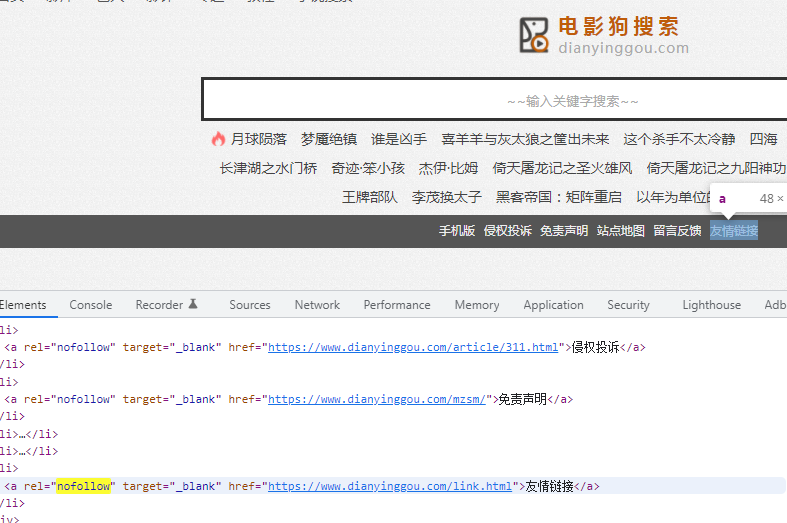

## SEO

#### **1.概论：**

搜索引擎通过爬虫获取页面数据，并返回服务器，<u>对于需要登录的页面不进行爬取</u>

1. 域名越长，爬虫效率越低
2. 不识别视频
3. 爬虫越多，越容易收录
4. 访问日志
5. 收录
   1. 有效收录
   2. 无效收录（质量大 〉收录量
6. 权重 （无意义，追求**高指数关键词**的排名
7. 百度爬取网站后的数据统计
   1. 展现量（搜索引擎中页面展示的位置
   2. 点击量
   3. 点击率（点击次数 /展现量
   4. 访问量  =〉跳出率 （进了就走
   5. 停留时间


#### **2.关键词：**

1. 指数
2. 相关结果
3. 广告位
4. 首页数量


#### **3.TDK:**

1. `title`
   1. 关键词1——关键词2——品牌词
   2. 字数 32
2. `description`
   1. 字数 60-80
   2. 保证用户需求
   3. 行业优势
   4. 包含关键词
3. `keys`关键词


#### **5.栏目（页眉，导航烂：**

引导用户点击

- 数量不会超过9个
- 符合用户需求
- 重要度排序


#### **6.锚本（点击跳转的文字：**

- 增减点击率，停留时间
- 增加蜘蛛爬行，每一个链接都是蜘蛛的入口
- 链接密度不超过 1%  （链接 /文字
- 不能多个链接指向**同一个文章**


#### **7.外链（把自己网站的地址发布到别人网站上去：**

1. 增加蜘蛛入口

2. 百度新算法降低了外链的权重

3. 一段文字不要发布多个平台

4. 友链

   1. 数量30个左右
   2. 优质友链会提高自己的权重

5. `nofollow`告诉爬虫不需要爬取目标页面，但它只能阻止自己权重的输出，不能阻止自己权重的损失

   一般用于：

   1. 留言板垃圾的广告
   2. 调用的功能模块（qq客服
   3. 广告
   4. 自己网页上不重要的页面链接，把爬虫导向重点的页面链接

   

   

   ```html
   <a href=“http://www.xxx.com” rel=“nofollow”>xxx</a>
   ```

6. 闪电算法

   加载速度，大于3s，减份


#### **ISSUE:**

1. 第一印象规则，第一次爬取效果好，之后会加权重。所以要`先做SEO`，等一次性优化好链网站，再上线
2. 一级域名会获得其下，二级，三级等域名的权重。所以尽量自己建站，购买一级域名
3. `h1`标签，只用一次，标识文章的标题，高权重
4. `alt`图片提高权重


