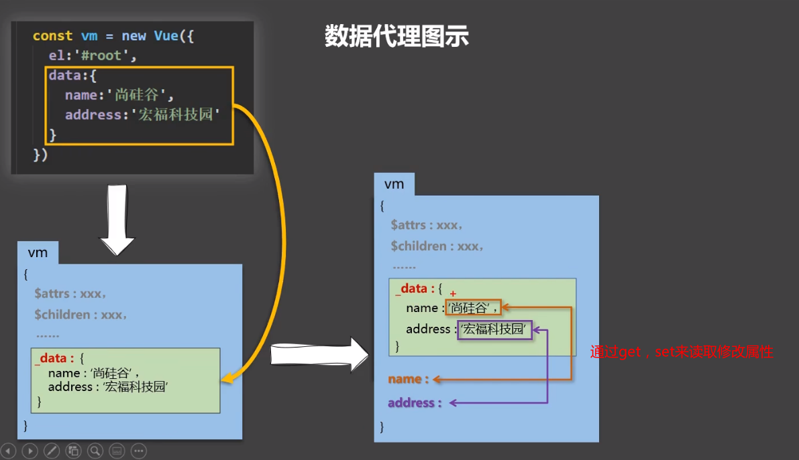

## 数据代理

通过一个对象，代理对另一个对象中属性的操作

```js
let obj1 = {x:100}

let obj2 = {y:200}

Object.defineProperty(obj2,'x',{
    get(){
        return obj1.x
    },
    set(val){
    	obj1.x = val
	}
})
```

这里读写obj2，就会改变obj1对应的属性




vue中的数据代理：

1. 通过vm对象来代理data递向中属性的操作(读写)
2. 可以更加方便的操作data中的数据(而不用写_data.xxx,直接写xxx)
3. 通过`Object.definProperty()` 把data对象中的所有属性添加到vm实例上，为每一个添加到vm上的属性，都指定一个getter，setter。之后在getter，setter内部去操作(读写)data中的对应的属性