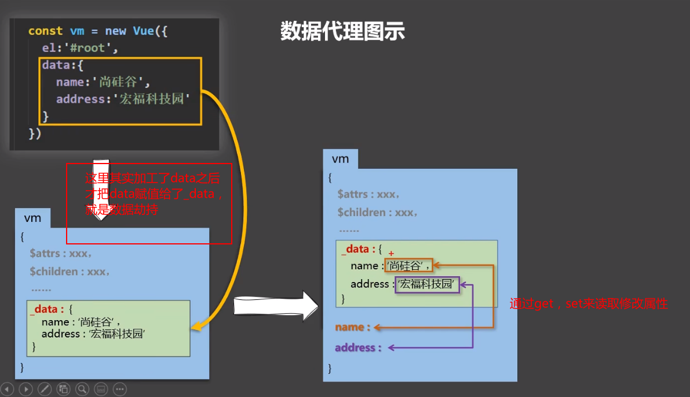

## 数据更新(劫持)




简单的数据劫持：(没有深拷贝，只能遍历第一层)

```js
<script>
    let data = {
        foo: "123",
        bar: "abc",
    };
function Observer(obj) {
    //对象 => 数组
    const keys = Object.keys(obj);
    //遍历
    keys.forEach((k) => {
        //修改Observer实例的的属性读写操作
        Object.defineProperty(this, k, {
            get() {
                //把当前obj对象的键值赋给实例的同键名k，
                return obj[k];
            },
            set(value) {
                //当修改了属性后，这里实际上写的是一个调用，这个调用会去页面中更新模板，也就实现了响应式

                console.log(`${k}被修改了`);
                obj[k] = value;
            },
        });
    });
}
//创建实例对象
let obs = new Observer(data);
//模拟vue实例对象
let vm = {};
//
vm._data = data = obs;
</script>
```

在setter中，每当修改了属性后，这里实际上写的是一个调用，这个调用会去页面中更新模板，也就实现了响应式


流程是：

属性修改 => 触发setter中一个重新解析模板的调用 =>重新解析模板 => 生成新的虚拟dom => 新旧dom对比 => 更新页面


**在data外添加属性，并使其拥有响应式：**

`Vue.set(target,'k','v')`

`vm.$set()`

只能在data中某一属性的内部添加新属性，而不能直接给data加


**更新数据是数组时：**

通过操作数组的索引值去改是不行的，要通过`push pop`等一系列数组方法去修改

这里也不是原生的方法，而是做了包装，vue自己写了一堆数组方法，同名，但在原生的基础上，还添加了监听变化，渲染页面的功能

`Array.prototype.push ===  vm.student.friends.push`  fasle

```json
methods: {
    updata() {
        //更新数组中的数据要通过原生的数组方法来做
        // this.persons[0] = { id: "001", name: "你大爷", age: 22, sex: "女" };
        this.persons.splice(0, 1, {
            id: "001",
            name: "你大爷",
            age: 22,
            sex: "女",
        });
    },
},
```

*ps：也可以通过set去修改*