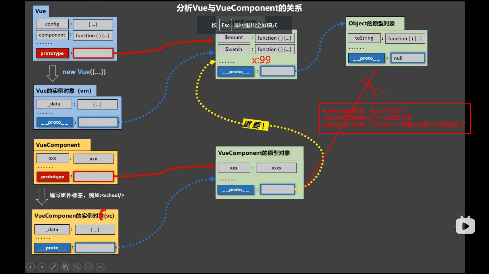

**关于VueComponet：**

1. 组件Foo 本质是一个名为VueComponent的构造函数,由Vue.extend生成(Vue.extend返还一个构造函数)
2. 每次使用标签<Foo></Foo> 时，vue会创建一个foo的实例对象，即，执行 new VueComponent(options)
   1. 即 `const Foo = Vue.extend({})` Foo接受了一个返回值，变成了一个构造函数
   2. 而在标签中使用`<Foo></Foo>` 才是创建了这个构造函数的实例对象
3. 组件中的this都指向该组件实例对象

**VueComponent.prototype.\__proto\__ === Vue.prototype**