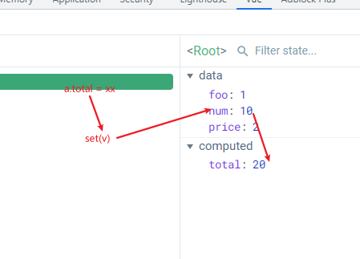

##  methods

其中定义方法，方法中的this指向的是vue实例对象，也就是可以访问data中的数据，然后操作


当页面中的data数据发生变化时，vue就会重新解析模板，而页面不知道`methods`里有没有引用data中发生变化的数据，所以每次数据变化的时候，就会重新执行一次`methods`


<div id="root">
            <input type="text" v-model="foo" /> {{bar()}}
        </div>
        <script src="../vue.js"></script>
        <script>
            new Vue({
                el: "#root",
                data: {
                    foo: 1,
                },
                methods: {
                    bar() {
                        console.log("@");
                        return this.foo;
                    },
                },
            });
        </script>


## computed


计算属性必须返回一个**计算后的结果**

会在调用时执行一次，和数据改变时执行一次，其他时候都是调用的**缓存数据**

其中依赖的数据若是来自于data中，当他们发生改变时，计算属性就会**自动执行一次**

```js
 let a = new Vue({
                el: "#root",
                data: {
                    foo: 1,
                    num: 5,
                    price: 2,
                },
                methods: {
                    bar() {
                        console.log("@");
                    },
                },
                computed: {
                    
                    total: {
                        get() {
                            console.log("1");
                            return this.num * this.price;
                        },
                        set(v) {
                            this.foo = v;
                        },
                    },
                },
            });
```

> a.total = xxx   =>set(v)
>
> =>
>
> this.num = v
>
> =>
>
> get()



当你确定不需要修改计算属性时，就这样写(一般都这样写)

```js
computed:{
    total() {
        console.log("1");
        return this.num * this.price;
    },
}
```

