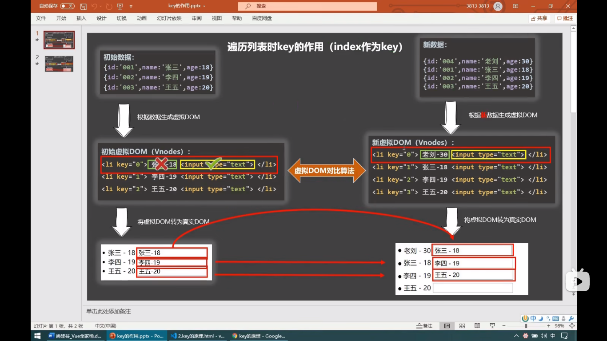

### 1. v-for 指令

`v-for="(item,index) in xxx" :key='主键'` 

key的内部原理：

1. 虚拟dom中key的作用：

   key作为虚拟dom 中的唯一标识，当数据发生变化时，vue会根据新数据生成新的虚拟dom，随后会在新的虚拟dom和旧的虚拟dom中做对比

2. 对比规则如下：

   1. 找到了相同的key：
      1. **虚拟dom**中的内容没有变化，则直接使用之前的**真实dom**
      2. **虚拟dom**中的内容变了，则生成新的**真实dom**，替换页面中之前的真实dom
   2. 没有找到相同的key：
      1. 直接创建新的**真实dom**，并渲染到页面

3. 用index作为key可能会引发的问题：

   1. 对数据进行添加：逆序添加删除都会产生没有必要的真实dom更新，**没有效率**
   2. 如果结构中还存在输入类的dom(input)，就会产生dom更新错位

4. 所以一般的key，都选用数据中的主键来担当

