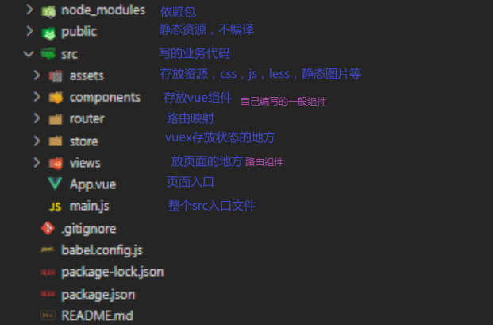

## 路由

**目录结构:**




路由(**route**)就是一组接口和其响应页面的对应关系，多个路由，需要经过路由器(**router**)的管理

路由用来实现单页面web应用(SPA)，

### 1.spa：

1. 整个应用只有一个完整的页面
2. 点击页面中的导航链接不会刷新页面，只会做页面的局部更新
3. 需要展示的数据需要通过ajax请求获取


### 2.基础路由：

1. 路由就是就是一组映射关系(key-value)
2. key为路径，value可能时function或者component
   1. 前端路由，value是component，用于展示页面的内容
      1. 工作过程：当浏览器的路径改变时，对应的组件就会显示
   2. 后端路由，value是function，用于处理客户端提起的请求(node的那一套)
      1. 工作过程：服务器接受到一个请求时，根据请求路径找到匹配的函数来处理请求，返回响应数据
3. 被切换走的组件其实是被销毁了，需要的时候再去挂载
4. 每个组件都有自己的`$route` 属性，里面存放着自己的路由信息(配置在路由映射关系中的key-value)
5. 整个应用只有一个 router ，可以通过组件的`$router` 属性获取


### 3.多级路由

1. 配置路由规则，使用children配置项，注意其中的path不要拼接 `/` 符号

   ```js
   routes:[
       {
        //一级路由
           //路径 key
           path: "/sidebar",
           //拦截的名字 叫 home
           name: "sidebar",
           //加载的组件 value
           component: sidebar,
        //二级路由
           children: [
               {
                   //路径不需要拼接 /符号
                   path: "inner1",
                   component: Inner1,
               },
               {
                   path: "inner2",
                   component: Inner2,
               },
           ],
       },
   ]
   ```

2. 页面跳转，路径要补全

   ```js
   <router-link to="/sidebar/inner1">inner1</router-link>
   ```


### 4.路由传参

#### 4.1 query` 参数`

**传递**：

写在 `router-link to:'../?参数=xxx&参数=xxx'`

```js
<router-link :to="`/sidebar/inner1/inner1Msg?id=${m.id}&title=${m.title}&author=${m.author}`">{{m.title}}</router-link> 
```

写在对象中

```js
<router-link :to="{
path:'/sidebar/inner1/inner1Msg',
    query:{
        id:m.id,
            title:m.title,
                author:m.author
    }
}" >{{m.title}}</router-link>
```

**命名路由(简化路由跳转):**

1. 在配置映射关系的地方给路由命名

   ```js
   {
       //命名路由
       name: "inner1Msg",
           path: "inner1Msg",
               component: inner1Msg,
   },
   ```

2. 简化跳转

   ```js
   <!-- 命名路由 -->
       <router-link :to="{
   name:'inner1Msg',
       query:{
           id:m.id,
               title:m.title,
                   author:m.author
       }
   }" >{{m.title}}</router-link>
   ```

   

#### 4.2 `params` 参数

在配置路由中要修改路径，使用占位符：

```js
children: [
    {
        //命名路由
        name: "inner2Msg",
        //params 传递参数的 占位写法
        path: "inner2Msg/:id/:title/:author",
        component: inner2Msg,
    },
],
```

传递参数，**必须要使用name**，命名路由的方式来声明路径

```js
<router-link :to="{
//params传递参数 必须用name 路由命名的形式
name:'inner2Msg',
    params:{
        id:m.id,
            title:m.title,
                author:m.author
    }
}">{{m.title}}</router-link>
</li>
```

#### 4.3 在配置路由的地方接收参数

query，params在组件中都是通过 `props:['id','xxx']` 来获取路由中接收的数据

```js
 props:['id','title','author'],
```


在路由配置层接收数据

1. 参数为 params

   ```js
   {
       path: "inner2",
           component: Inner2,
               children: [
                   {
                       //命名路由
                       name: "inner2Msg",
                       //params 传递参数的 占位写法
                       path: "inner2Msg/:id/:title/:author",
                       component: inner2Msg,
                       //把路由接收所有的params参数通过props传递给inner2Msg组件
                       props: true,
                   },
               ],
   },
   ```

2. 参数为 query

   此处props是一个函数，返回一个接收传递参数的对象

   ```js
   {
       //路径不需要拼接 /符号
       path: "inner1",
           component: Inner1,
               //三级路由 传递参数的演示
               children: [
                   {
                       //命名路由
                       name: "inner1Msg",
                       path: "inner1Msg",
                       component: inner1Msg,
                       //把路由接收所有的query参数通过props传递给inner2Msg组件
                       props($route) {
                           return {
                               id: $route.query.id,
                               title: $route.query.title,
                               author: $route.query.author,
                           };
                       },
                   },
               ],
   },
   ```

3. 当传递的参数是一个完整的对象时，query和params直接接收一个对象，在接收页面处再处理这个对象

   params的占位符 `：` 后面不跟东西即可

   ```js
   {
       props: true,
           path: "CNFilmes/:",
               component: CNFilmes,
                   name: "CNFilmes",
   },
   ```

   

### 5.路由的跳转模式

#### 5.1 基本跳转

默认是 `push` 模式，可以前进后退

`replace` 模式是替换当前记录

开启：

```js
<router-link replace ....></router-link>
```

#### 5.2 编程式路由导航

不借助`router-link` 实现跳转

`push` 是压入

`replace` 是替换

`back()` 回退一个页面

`forward()` 前进一个页面

`go(n)` 去到第几个页面，n为正是前进，为负是后退

```js

this.$router.push({
    //路径
    name:'xxx',
    params:{
        id:xx,
        title:xxx
    }
})

this.$router.replace({
    //路径
    name:'xxx',
    params:{
        id:xx,
        title:xx
    }
})

this.$router.back()
this.$router.forward()
this.$router.go(n)
```


### 6.缓存路由组件

让被切换走的路由组件 保持挂载，不被销毁

注意，要确定该组件是在哪个router-view中展示的

```js
<keep-alive include='组件的名字'>
    <router-view/>
</keep-alive>
```


### 7.路由组件的两个生命周期钩子

用于捕获路由组件的激活状态

`activated` 路由组件激活时触发

`deactivative` 路由组件失活(切换走了)时触发


### 8.路由守卫

对路由进行权限控制

#### 8.1 前置路由守卫

初始化时执行，每次路由跳转前执行

`to`  跳转的目的地

`from` 从哪里跳过来的

`next` 下一步，放行，这个必须写，不然路由拦截之后不会让请求通过

`meta` 路由元信息，由玩家自定义在路由配置中的信息，用于权限控制(前置路由)，或者更换title(后置)

```js
router.beforEach((to,from,next)= >{
    //这里查看是不是需要控制路由，通过查看meta里面有没有对应的值
    if(to.meta.XXX){
    //一般在这里做权限判断，token啊，session啊都无所谓
        if(权限判断){
            //放行
            next()
        }else{
            //这里是权限没有通过的,当然不能让他next()了
            alert('fxxk off')
        }
    }else{
    //这里是不需要控制路由的路径
    next()
}

}
)
```

#### 8.2 后置路由守卫

初始化时执行，每次路由跳转后执行

与前者大致相同，只是没有next()

这里是通过前置路由之后，根据路由配置中的meta来根换页面标签名字

```js
router.afterEach((to) => {
    if (to.meta.title) {
        document.title = to.meta.title;
    } else {
        document.title = "vue-router-study";
    }
});
```

#### 8.3 独享路由守卫

和上面的完全一样，只是作用与当前路由项中

```js
beforeEnter((to,from,next) => {
    
})
```

注意的是，独享没有后置守卫，但是可以和全局的后置路由守卫一起用


#### 8.4 组件路由守卫

通过**路由规则**，进入或离开该组件时被调用

(注意是通过路由规则进入，才可以触发，如果是通过import导入一个组件则不在此适用范围内)

```js
beforeRouteEnter(to, from, next) {
    console.log("beforeRouteEnter");
    next();
},
    beforeRouteLeave(to, from, next) {
        console.log("beforeRouteLeave");
        next();
    },
```

和全局路由守卫混用时的触发顺序

> 1.beforeLeave() ------------上一个路由组件
>
> =>
>
> 2.beforeEach()
>
> =>
>
> 3.beforeEnter()---------------当前路由组件
>
> =>
>
> 4.afterEach()
>
> =>
>
> 下一次跳转
>
> 1.beforeLeave() ------------当前路由组件
>
> 


### 9.路由的工作模式

通过路由对象的配置项更改，默认hash

`mode:'hash | history'` 

#### 9.1 hash模式

1. 对前端来说的hash值是指地址栏中 # 后面的一串地址，
2. hash值不会包含在http请求中，即，hash值不会带给服务器
3. 兼容性好，但是不好看


#### 9.2 history模式

1. 地址栏中不包含 #，但是会把前端路由的跳转地址发送给服务器
2. 解决这个问题需要在后端做正则判断，哪些路由是前端路由，哪些是后端路由


