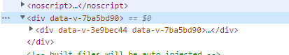
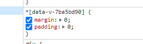

1. 获取元素节点对象 `this.$ref.xxx`

   ```js
   <h2 ref="foo">naiton:{{ area.name }}</h2>
   ----
   this.$refs.foo //h2节点对象
   ```

   这个可以获取**子组件**的节点对象(比如，子组件向父组件传递参数)

   ```js
   <componentFoo ref='bar' />
   ----
   this.$refs.bar //bar组件的节点对象
   ```

2. style标签的 `scoped`属性 

   使当前样式仅应用在此vue文件中，防止冲突

   他实际上是在元素中加上了一个随机生成的标签属性，再配合标签属性选择器使其应用样式生效

   

   

3. `this.$nextTick(callback())` 在下一次dom更新后执行其指定的回调函数

   比如要让一个新添加的input框自动获取焦点，直接写focus()是不行的，因为挂载该方法时，dom还没有完成更新，所以要用到上述的方法

   ```js
   this.$nextTick(function () {
       this.$refs.inputFocus.focus();
   });
   ```

4. 使用cmd 中的`rimraf node_module` 来删除依赖包

