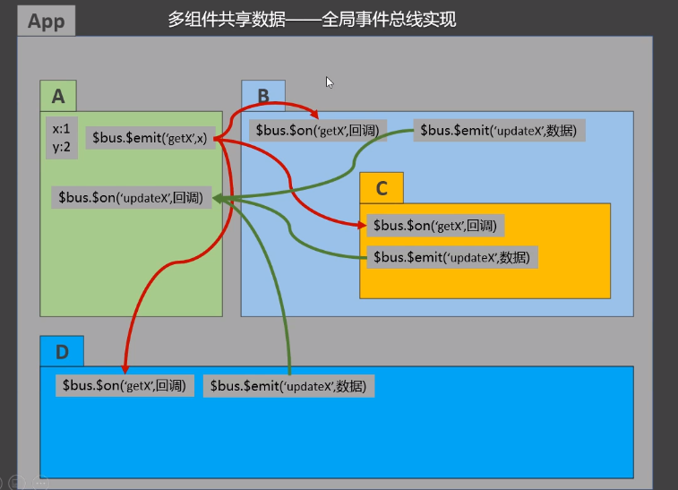
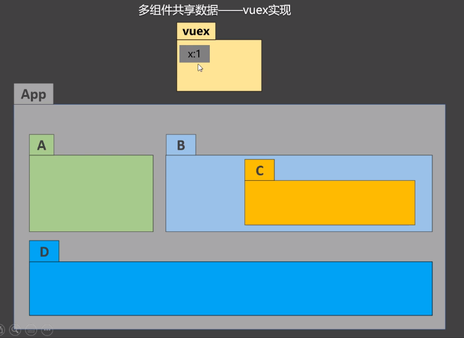

## vuex

> vuex是专门用于在vue中实现集中式状态(数据)管理的一个vue插件，对vue应用中的多个组件的共享状态进行集中式的管理(读/写)。
>
> 也是组件间通信的方式，且适用于任意组件间的通信

没有vuex的时候，想要实现多组件共享数据，可以通过全局事件总线来实现。但是当B,C,D组件想要修改A组件中的x的值的时候，又需要再写一套$on和$emit。可能会比较乱，但也不是写不出来




有了vuex，就像下面这样：



**vuex的应用场景：**

1. 多个组件依赖于同一个状态
2. 来自不同组件的行为需要变更为统一状态


### 1.vuex的原理


**state：**

对象，用于保存一堆数据的状态(什么时候是什么值)

**vue components：**

组件

**store.dispatch:**

组件中调用dispatch('使用的函数',传递的函数值)

**actions：**

对象，必定有一个key和dispatch传递的函数对应，匹配后就调用这个函数。

**这个环节不是必要的，可以直接由vuecomponents向mutations传递函数。(不需要dispatch，直接使用commit)**

他的意义在于，传递函数的值，如果需要**ajax请求**回来，就必须要用actions了

**store.commit：**

调用commit('使用的函数',传递的函数值)

**mutations:**

对象，其中也会保存一个key函数和调用的函数对应，不同的是这个函数其中包括两个东西，一是state，一是传递过来的函数值

**mutate：**

自动执行，会根据mutations中的函数去更新state中对应数据的状态

**render：**

vuex检测到state中数据状态的变化，会自动重新渲染组件页面


### 2.搭建vuex环境

1. npm i vuex@3

2. Vue.use(Vuex)

3. store 文件夹 -> index.js

   ```js
   //配置store
   
   //引入vuex,vue
   import Vuex from "vuex";
   import Vue from "vue";
   
   //用于响应组件中的动作
   const actions = {};
   
   //用于操作数据
   const mutations = {};
   
   //用于储存数据
   const state = {};
   
   //使用插件
   Vue.use(Vuex);
   
   //创建并暴露
   export default new Vuex.Store({
       actions,
       mutations,
       state,
   });
   
   ```

   main.js

   ```js
   import Vue from "vue";
   
   import App from "./App.vue";
   //引入store
   import store from "./store";
   
   //使用插件
   // Vue.use(Vuex);
   //因为import执行顺序的问题，它会先执行所有的import，再执行其他语句
   //写在了store中
   
   new Vue({
       render: (h) => h(App),
       //挂载store
       store,
       beforeCreate() {
           Vue.prototype.$bus = this;
       },
   }).$mount("#app");
   
   ```

4. vc ==> store

   每一个组件实例上就挂载了$store的方法了


### 3.基本使用

1. 初始化数据、配置```actions```、配置```mutations```，操作文件```store.js```

   ```js
   //引入Vue核心库
   import Vue from 'vue'
   //引入Vuex
   import Vuex from 'vuex'
   //引用Vuex
   Vue.use(Vuex)
   
   const actions = {
       //响应组件中加的动作
   	jia(context,value){
   		// console.log('actions中的jia被调用了',miniStore,value)
   		context.commit('JIA',value)
   	},
   }
   
   const mutations = {
       //执行加
   	JIA(state,value){
   		// console.log('mutations中的JIA被调用了',state,value)
   		state.sum += value
   	}
   }
   
   //初始化数据
   const state = {
      sum:0
   }
   
   //创建并暴露store
   export default new Vuex.Store({
   	actions,
   	mutations,
   	state,
   })
   ```

2. 组件中读取vuex中的数据：```$store.state.sum```

3. 组件中修改vuex中的数据：```$store.dispatch('action中的方法名',数据)``` 或 ```$store.commit('mutations中的方法名',数据)```

   > 备注：若没有网络请求或其他业务逻辑，组件中也可以越过actions，即不写```dispatch```，直接编写```commit```

### 4.getters

1. 概念：当state中的数据需要经过加工后再使用时，可以使用getters加工。

2. 在```store.js```中追加```getters```配置

   ```js
   ......
   
   const getters = {
   	bigSum(state){
   		return state.sum * 10
   	}
   }
   
   //创建并暴露store
   export default new Vuex.Store({
   	......
   	getters
   })
   ```

3. 组件中读取数据：```$store.getters.bigSum```

### 4.vuex中四个map方法

引入各种映射方法

```js
import {mapState,mapMutations,mapActions,mapGetters} from "vuex"
```


map即为vuex管理状态数据的**映射**，避免代码重复

1. mapState方法：</strong>用于帮助我们映射```state```中的数据为计算属性

   ```js
   computed: {
       //借助mapState生成计算属性：sum、school、subject（对象写法）
        ...mapState({sum:'sum',school:'school',subject:'subject'}),
            
       //借助mapState生成计算属性：sum、school、subject（数组写法）
       ...mapState(['sum','school','subject']),
   },
   ```

2. <strong>mapGetters方法：</strong>用于帮助我们映射```getters```中的数据为计算属性

   ```js
   computed: {
       //借助mapGetters生成计算属性：bigSum（对象写法）
       ...mapGetters({bigSum:'bigSum'}),
   
       //借助mapGetters生成计算属性：bigSum（数组写法）
       ...mapGetters(['bigSum'])
   },
   ```

3. <strong>mapActions方法：</strong>用于帮助我们生成与```actions```对话的方法，即：包含```$store.dispatch(xxx)```的函数

   ```js
   methods:{
       //靠mapActions生成：incrementOdd、incrementWait（对象形式）
       ...mapActions({incrementOdd:'jiaOdd',incrementWait:'jiaWait'})
   
       //靠mapActions生成：incrementOdd、incrementWait（数组形式）
       ...mapActions(['jiaOdd','jiaWait'])
   }
   ```

4. <strong>mapMutations方法：</strong>用于帮助我们生成与```mutations```对话的方法，即：包含```$store.commit(xxx)```的函数

   ```js
   methods:{
       //靠mapActions生成：increment、decrement（对象形式）
       ...mapMutations({increment:'JIA',decrement:'JIAN'}),
       
       //靠mapMutations生成：JIA、JIAN（对象形式）
       ...mapMutations(['JIA','JIAN']),
   }
   ```

> 备注：mapActions与mapMutations使用时，若需要传递参数需要：在模板中绑定事件时传递好参数，否则参数是事件对象

### 5.模块化+命名空间

1. 目的：让代码更好维护，让多种数据分类更加明确。

2. 修改```store.js``` **可能不太对，用时查阅资料**

   ```javascript
   const countAbout = {
     namespaced:true,//开启命名空间
     state:{x:1},
     mutations: { ... },
     actions: { ... },
     getters: {
       bigSum(state){
          return state.sum * 10
       }
     }
   }
   
   const personAbout = {
     namespaced:true,//开启命名空间
     state:{ ... },
     mutations: { ... },
     actions: { ... }
   }
   
   const store = new Vuex.Store({
     modules: {
       countAbout,
       personAbout
     }
   })
   ```

3. 开启命名空间后，组件中读取state数据：

   ```js
   //方式一：自己直接读取
   this.$store.state.personAbout.list
   //方式二：借助mapState读取：
   ...mapState('countAbout',['sum','school','subject']),
   ```

4. 开启命名空间后，组件中读取getters数据：

   ```js
   //方式一：自己直接读取
   this.$store.getters['personAbout/firstPersonName']
   //方式二：借助mapGetters读取：
   ...mapGetters('countAbout',['bigSum'])
   ```

5. 开启命名空间后，组件中调用dispatch

   ```js
   //方式一：自己直接dispatch
   this.$store.dispatch('personAbout/addPersonWang',person)
   //方式二：借助mapActions：
   ...mapActions('countAbout',{incrementOdd:'jiaOdd',incrementWait:'jiaWait'})
   ```

6. 开启命名空间后，组件中调用commit

   ```js
   //方式一：自己直接commit
   this.$store.commit('personAbout/ADD_PERSON',person)
   //方式二：借助mapMutations：
   ...mapMutations('countAbout',{increment:'JIA',decrement:'JIAN'}),
   ```

## 