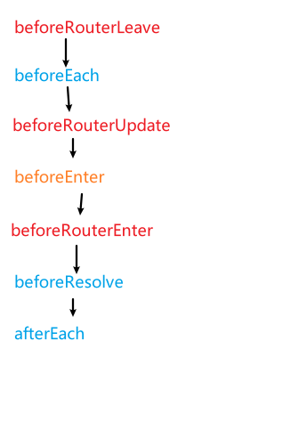
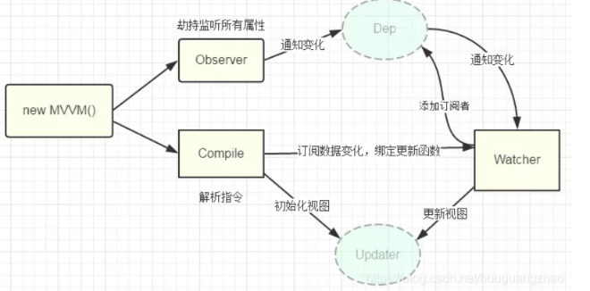

最全vue面试题+详解答案

#### 1、MVC 和 MVVM 区别

**MVC**

MVC全名是 Model View Controller,时模型 - 视图 - 控制器的缩写，一种软件设计典范。

*   Model(模型)：是用于处理应用程序数据逻辑部分。通常模型对象负责在数据库中存取数据。
*   View(视图)：是应用程序中处理数据显示的本分。通常视图是依据模型数据创建的。
*   Controller(控制器)：是应用程序处理用户交互的部分。通常控制器负责从视图读取数据，控制用户输入，并向模型发送数据。

MVC的思想：一句话描述就是Controller负责将Model的数据用View显示出来，换句话说就是在Controller里面把Model的数据赋值给View。

**MVVM**

MVVM新增了VM类。

ViewModel层：做了两件事达到了数据的双向绑定，一是将【模型】转化成【视图】，即将后端传递的数据转化成所看到的页面。 实现的方式时：数据绑定。二是将【视图】转化成【模型】，即将所看到的页面转换成后端的数据。实现的方式是：DOM事件监听。

MVVM与MVC最大的区别就是：实现了View和Model的自动同步，也就是当Model的属性改变时，我们不用再手动操作Dom元素来改变View的显示。 而是改变属性后该属性对应的View层显示会自动改变（对应Vue数据驱动的思想）

整体看来，MVVM比MVC精简很多，不仅简化了业务与界面的依赖，还解决了数据频繁更新的问题，不用再用选择器操作DOM元素。因为在MVVM中，View不知道Model的存在，Model和ViewModel也察觉不到View，这种低耦合模式提高代码的可重用性。

注意：Vue并没有完全遵循MVVM的思想，这一点官网自己也有声明。  

那么问题来了，为什么官方要说Vue没有完全遵循MVVM思想呢？  
严格的MVVVM要求View不能和Model直接通信，而Vue提供了$refs这个属性，让Model可以直接操作View，违反了这一规定，所以是Vue没有完全遵循MVVM。

#### 2、为什么data是一个函数

组件的data写成一个函数，数据以函数返回值形式定义，这样每复用一次组件，就会返回一分新的data，类似于给每个组件实例创建一个私有的数据空间，让各个组件实例维护各自的数据。而单纯的写成对象形式，就使得所有组件实例共用了一份data，就会造成一个变了全都会变的结果。

#### 3、Vue组件通讯有哪些方式？

1、props 和 $emit。父组件向子组件传递数据是通过props传递的，子组件传递给父组件是通过$emit触发事件来做到的。

2、$parent 和 $children 获取单签组件的父组件和当前组件的子组件。

3、$attrs 和 $listeners A -> B -> C。Vue2.4开始提供了$attrs和$listeners来解决这个问题。

4、父组件中通过 provide 来提供变量，然后在子组件中通过 inject 来注入变量。（官方不推荐在实际业务中适用，但是写组件库时很常用。）

5、$refs 获取组件实例。

6、envetBus 兄弟组件数据传递，这种情况下可以使用事件总线的方式。

7、vuex 状态管理。

#### 4、Vue的生命周期方法有哪些？一般在哪一步发送请求？

**beforeCreate** 在实例初始化之后，数据观测（data observe）和 event/watcher 事件配置之前被调用。在当前阶段 data、methods、computed 以及 watch 上的数据和方法都不能被访问。

**created** 实例已经创建完成之后被调用。在这一步，实例已经完成以下的配置：数据观测（data observe ），属性和方法的运算，watch/event 事件回调。这里没有 $el，如果非要想与 DOM 进行交互，可以通过vm.$nextTick 来访问 DOM。

**beforeMount** 在挂载开始之前被调用：相关的 render 函数首次被调用。

**mounted** 在挂载完成后发生，在当前阶段，真实的 Dom 挂载完毕，数据完成双向绑定，可以访问到 Dom节点。

**beforeUpdate** 数据更新时调用，发生在虚拟 DOM 重新渲染和打补丁 （patch）之前。可以在这个钩子中进一步地更改状态，这不会触发附加的重渲染过程。

**updated** 发生在更新完成之后，当前阶段组件 Dom 已经完成更新。要注意的是避免在此期间更新数据，因为这个可能导致无限循环的更新，该钩子在服务器渲染期间不被调用。

**beforeDestroy** 实例销毁之前调用。在这一步，实力仍然完全可用。我们可以在这时进行 善后收尾工作，比如清除定时器。

**destroy** Vue实例销毁后调用。调用后，Vue实例指示的东西都会解绑定，所有的事件监听器会被移除，左右的子实例也会被销毁，该钩子在服务器端渲染不被调用。

**activated** keep-alive 专属，组件被激活时调用

**deactivated** keep-alive 专属，组件被销毁时调用

异步请求在哪一步发起？

可以在钩子函数 created、beforeMount、mounted 中进行异步请求，因为在这三个钩子函数中，data已经创建，可以将服务器端返回的数据进行赋值。

如果异步请求不需要依赖 DOM 推荐加载 created 钩子函数中调用异步请求，因为在 created 钩子函数中调用异步请求有以下优点：

*   能更快获取到服务端数据，减少页面loading时间；
*   ssr 不支持 beforeMount、mounted 钩子函数，所以放在 created 中有助于一致性。

#### 5、v-if 和 v-show 的区别

v-if 在编译过程中会被转化成三元表达式，条件不满足时不渲染此节点。

v-show 会被编译成指令，条件不满足时控制样式将此节点隐藏（display:none）

**使用场景**

v-if 适用于在运行时很少改变条件，不需要频繁切换条件的场景。

v-show 适用于需要非常频繁切换条件的场景。

扩展补充：display:none 、 visibility:hidden 和 opacity:0 之间的区别？

三者公共点都是隐藏。不同点：

*   一、是否占据空间。  
    display:none，隐藏之后不占位置；visibility:hidden、opacity:0，隐藏后任然占据位置。
*   二、子元素是否继承。  
    display:none --- 不会被子元素继承，父元素都不存在了，子元素也不会显示出来。  
    visibility:hidden --- 会被子元素继承，通过设置子元素 visibility:visible 来显示子元素。  
    opacity:0 --- 会被子元素继承，但是不能设置子元素 opacity:0 来先重新显示。
*   三、事件绑定。  
    display:none 的元素都已经不存在了，因此无法触发他绑定的事件。  
    visibility:hidden 不会触发他上面绑定的事件。  
    opacity:0 元素上面绑定的事件时可以触发的。
*   四、过度动画。  
    transition对于display是无效的。  
    transition对于visibility是无效的。  
    transition对于opacity是有效的。

#### 6、说说 vue 内置指令

*   v-once - 定义它的元素或组件只渲染一次，包括元素或组件的所有节点，首次渲染后，不再随数据的变化重新渲染，将被视为静态内容。
*   v-cloak - 这个指令保持在元素上直到关联实例结束编译 -- 解决初始化慢到页面闪动的最佳实践。
*   v-bind - 绑定属性，动态更新HTML元素上的属性。例如 v-bind:class。
*   v-on - 用于监听DOM事件。例如 v-on:click v-on:keyup
*   v-html - 赋值就是变量的innerHTML -- 注意防止xss攻击
*   v-text - 更新元素的textContent
*   v-model - 1、在普通标签。变成value和input的语法糖，并且会处理拼音输入法的问题。2、再组件上。也是处理value和input语法糖。
*   v-if / v-else / v-else-if。可以配合template使用；在render函数里面就是三元表达式。
*   v-show - 使用指令来实现 -- 最终会通过display来进行显示隐藏
*   v-for - 循环指令编译出来的结果是 -L 代表渲染列表。优先级比v-if高最好不要一起使用，尽量使用计算属性去解决。注意增加唯一key值，不要使用index作为key。
*   v-pre - 跳过这个元素以及子元素的编译过程，以此来加快整个项目的编译速度。

#### 7、怎样理解 Vue 的单项数据流

数据总是从父组件传到子组件，子组件没有权利修改父组件传过来的数据，只能请求父组件对原始数据进行修改。这样会防止从子组件意外改变父组件的状态，从而导致你的应用的数据流向难以理解。

注意：在子组件直接用 v-model 绑定父组件传过来的 props 这样是不规范的写法，开发环境会报警告。

如果实在要改变父组件的 props 值可以再data里面定义一个变量，并用 prop 的值初始化它，之后用$emit 通知父组件去修改。

#### 8、computed 和 watch 的区别和运用的场景。

computed 是计算属性，依赖其它属性计算值，并且 computed 的值有缓存，职友集当计算值变化才会返回内容，他可以设置getter和setter。

watch 监听到值的变化就会执行回调，在回调中可以进行一系列的操作。

计算属性一般用在模板渲染中，某个值是依赖其它响应对象甚至是计算属性而来；而侦听属性适用于观测某个值的变化去完成一段复杂的业务逻辑。

#### 9、v-if 和 v-for 为什么不建议一起使用

v-for和v-if不要在同一标签中使用，因为解析时先解析v-for在解析v-if。如果遇到需要同时使用时可以考虑写成计算属性的方式。

#### 10、Vue 2.0 响应式数据的原理

整体思路是数据劫持 + 观察者模式

对象内部通过 defineReactive 方法，使用 Object.defineProperty 将属性进行劫持（只会劫持已存在的属性），数组则是通过重写数组来实现。当页面使用对应属性时，每个属性都拥有自己的 dep 属性，存在它所依赖的 watcher （依赖收集）get，当属性变化后会通知自己对应的 watcher 去更新（派发更新）set。

1、Object.defineProperty 数据劫持  
2、使用 getter 收集依赖 ，setter 通知 watcher派发更新。  
3、watcher 发布订阅模式。  

#### 11、Vue 如何检测数组变化

数组考虑性能原因没有用 defineProperty 对数组的每一项进行拦截，而是选择对7种数组（push,shift,pop,splice,unshift,sort,reverse）方法进行重写（AOP 切片思想）。

所以在 Vue 中修改数组的索引和长度无法监控到。需要通过以上7种变异方法修改数组才会触发数组对应的watcher进行更新。

#### 12、Vue3.0 用过吗？了解多少？

*   响应式原理的改变 Vue3.x 使用 Proxy 取代 Vue2.x 版本的 Object.defineProperty。
*   组件选项声明方式 Vue3.x 使用 Composition API setup是Vue3.x新增的一个选项，他是组件内使用Composition API 的入口。
*   模板语法变化 slot 具名插槽语法，自定义指令v-model升级。
*   其他方面的更改 Suspense支持Fragment（多个根节点）和 Protal（在dom其他部分渲染组件内容）组件，针对一些特殊的场景做了处理。基于 treeShaking 优化，提供了更多的内置功能。

#### 13、Vue3.0 和 2.0 的响应式原理区别

Vue3.x 改用 Proxy 替代 Object.defineProperty。因为 Proxy 可以直接监听对象和数组的变化，并且有多达13种拦截方法。

#### Vue的父子组件生命周期钩子函数执行顺序

*   加载渲染过程
父beforeCreate -> 父created -> 父beforeMount -> 子beforeCreate -> 子created -> 子beforeMount -> 子mounted -> 父mounted*   子组件更新过程
父beforeUpdate -> 子beforeUpdate -> 子updated -> 父updated*   父组件更新过程
父beforeUpdate -> 父updated*   销毁过程
父beforeDestroy -> 子beforeDestroy -> 子destroyed -> 父destroyed

#### 15、虚拟DOM是什么？有什么优缺点？

由于在浏览器中操作DOM是很昂贵的。频繁操作DOM，会产生一定性能问题。这就是虚拟Dom的产生原因。Vue2的Virtual DOM 借鉴了开源库 snabbdom 的实现。Virtual DOM本质就是用一个原生的JS对象去描述一个DOM节点，是对真实DOM的一层抽象。

**优点：**   
1、保证性能下限：框架的虚拟DOM需要适配任何上层API可能产生的操作，他的一些DOM操作的实现必须是普适的，所以它的性能并不是最优的；但是比起粗暴的DOM操作性能要好很多，因此框架的虚拟DOM至少可以保证在你不需要手动优化的情况下，依然可以提供还不错的性能，既保证性能的下限。  
2、无需手动操作DOM：我们不需手动去操作DOM，只需要写好 View-Model的 代码逻辑，框架会根据虚拟DOM和数据双向绑定，帮我们以可预期的方式更新视图，极大提高我们的开发效率。  
3、跨平台：虚拟DOM本质上是JavaScript对象，而DOM与平台强相关，相比之下虚拟DOM可以进行更方便地跨平台操作，例如服务器端渲染、weex开发等等。  
**缺点：**   
1、无法进行极致优化：虽然虚拟DOM + 合理的优化，足以应对大部分应用的性能需要，但在一些性能要求极高的应用中虚拟DOM无法进行针对性的极致优化。  
2、首次渲染大量DOM时，由于多了一层DOM计算，会比innerHTML插入慢。

#### 16、v-model 原理

v-model 只是语法糖而已。  
v-model 在内部为不同的输入元素使用不同的 property 并抛出不同的事件。

*   text 和 textarea 元素使用 value property 和 input 事件；
*   checkbox 和 radio 使用 checked property 和 change事件；
*   select 字段将 value 作为 prop 并将 change 作为事件。

注意：对于需要使用输入法的语言，你会发现 v-model 不会在输入法组合文字过程中得到更新。

在普通元素上：  
`input v-model='sth'`  
`input v-bind:value='sth' v-on:input='sth = $event.target.value'`

#### 17、v-for为什么要加key

如果不使用key，Vue会使用一种最大限度减少动态元素并且尽可能的尝试就地修改/复用相同类型元素的算法。key 是为Vue中Vnode的唯一标识，通过这个key，我们的diff操作可以更准确、更快速。  
**更准确：** 因为带key就不是就地复用了，在sameNode函数 a.key === b.key 对比中可以避免就地复用的情况。所以更加准确。  
**更快速：** 利用key的唯一性生成map对象来获取对应节点，比遍历方式块。

#### 18、Vue事件绑定原理

原生事件绑定是通过 addEventListener 绑定给真实元素的，组件事件绑定是通过Vue自定义的$on实现的。如果要在组件上使用原生事件，需要加.native修饰符，这样就相当于在父组件中把子组件当做普通的HTML标签，然后加上原生事件。  
$on、$emit 是基于发布订阅模式的，维护一个事件中心，on的时候将事件按名称存在事件中心里，称之为订阅者，然后emit将对应的事件进行发布，去执行事件中心里的对应的监听器。

#### 19、vue-router 路由钩子函数是什么？执行顺序是什么？

路由钩子的执行流程，钩子函数种类有：全局守卫、路由守卫、组件守卫。

**完整的导航解析流程：**   
1、导航被触发。  
2、在失活的组件里调用 beforeRouterLeave 守卫。  
3、调用全局的 beforeEach 守卫。  
4、在重用的组件调用 beforeRouterUpdate 守卫（2.2+）。  
5、在路由配置里面 beforeEnter。  
6、解析异步路由组件。  
7、在被激活的组件里调用 beforeRouterEnter。  
8、调用全局的 beforeResolve 守卫（2.5+）。  
9、导航被确认。  
10、调用全局的 afterEach 钩子。  
11、触发 DOM 更新。  
12、调用 beforeRouterEnter 守卫中传给next的回调函数，创建好的组件实例会作为回调函数的参数传入。

#### 20、vue-router 动态路由是什么？有什么问题。

我们经常需要把某种模式匹配到的所有路由，全都映射到同个组件。例如，我们有一个 User组件，对于所有 ID 各不相同的用户，都要使用这个组件来渲染。那么，我们可以在 vue-router 的路由路径中使用“动态路径参数”（dynamic segment）来达到这个效果： const User = {  
template: "

User

", };  
const router = new VueRouter({  
routes: \[  
// 动态路径参数 以冒号开头  
{ path: "/user/:id", component: User },  
\],  
});  
问题：vue-router 组件复用导致路由参数失效怎么办？  
解决方案：  
1、通过watch监听路由参数再发请求  
watch：{  
"router":function(){  
this.getData(this.$router.params.xxx)  
}  
}  
2、用 :key来阻止复用  
router-view :key="$route.fullPath"

#### 21、谈一下对 vuex 的个人理解

vuex 是专门为 vue 提供的全局状态管理系统，用于多个组件中数据共享、数据缓存等。（无法持久化、内部内心原理是通过创造一个全局实例 new Vue）

主要包括以下几个模块：

*   State:定义了应用状态的数据结构，可以在这里设置默认的初始化状态。
*   Getter:允许组件从Store中获取数据，mapGetters 辅助函数仅仅是将 store 中的 getter 映射到局部计算属性。
*   Mutation:是唯一更改 store 中状态的方法，且必须是同步函数。
*   Action:用于提交 mutation，而不是直接变更状态，可以包含任意异步请求。
*   Module:允许将单一的 Store 拆分更多个 store 且同时保存在单一的状态树中。

#### 22、Vuex 页面刷新数据丢失怎么解决？

需要做 vuex 数据持久化，一般使用本地储存的方案来保存数据，可以自己设计存储方案，也可以使用第三方插件。  
推荐使用 vuex-persist (脯肉赛斯特)插件，它是为 Vuex 持久化储存而生的一个插件。不需要你手动存取 storage，而是直接将状态保存至 cookie 或者 localStorage中。

#### 23、Vuex 为什么要分模块并且加命名空间？

**模块**： 由于使用单一状态树，应用的所有状态会集中到一个比较大的对象。当应用变得非常复杂时，store 对象就有可能会变得相当臃肿。为了解决以上问题，Vuex 允许我们将 store 分割成模块（module）。每个模块拥有自己的 state、mutation、action、getter、甚至是嵌套子模块。

**命名空间**： 默认情况下，模块内部的 action、mutation、getter是注册在全局命名空间的 --- 这样使得多个模块能够对同一 mutation 或 action 做出响应。如果希望你的模块具有更高的封装度和复用性，你可以通过添加 namespaced:true 的方式使其成为带命名的模块。当模块被注册后，他所有 getter、action、及 mutation 都会自动根据模块注册的路径调整命名。

#### 24、使用过 Vue SSR 吗？说说 SSR

SSR 也就是服务端渲染，也就是将 Vue 在客户端把标签渲染成 HTML 的工作放在服务端完成，然后再把 html 直接返回给客户端。

**优点：**   
SSR 有着更好的 SEO、并且首屏加载速度更快。  
**缺点：**   
开发条件会受限制，服务器端渲染只支持 beforeCreate 和 created 两个钩子，当我们需要一些外部扩展库时需要特殊处理，服务端渲染应用程序也需要处于 Node.js 的运行环境。  
服务器会有更大的负载需求。

#### 25、vue 中使用了哪些设计模式？

1、工厂模式 - 传入参数即可创建实例  
虚拟 DOM 根据参数的不同返回基础标签的 Vnode 和组件 Vnode。

2、单例模式 - 整个程序有且仅有一个实例  
vuex 和 vue-router 的插件注册方法 install 判断如果系统存在实例就直接返回掉。

3、发布-订阅模式。（vue 事件机制）

4、观察者模式。（响应式数据原理）

5、装饰器模式（@装饰器的用法）

6、策略模式，策略模式指对象有某个行为，但是在不同的场景中，该行为有不同的实现方案 - 比如选项的合并策略。

#### 26、你都做过哪些 Vue 的性能优化？

这里只列举针对 Vue 的性能优化，整个项目的性能优化是一个大工程。

*   对象层级不要过深，否则性能就会差。
*   不需要响应式的数据不要放在 data 中（可以使用 Object.freeze() 冻结数据）
*   v-if 和 v-show 区分使用场景
*   computed 和 watch 区分场景使用
*   v-for 遍历必须加 key，key最好是id值，且避免同时使用 v-if
*   大数据列表和表格性能优化 - 虚拟列表 / 虚拟表格
*   防止内部泄露，组件销毁后把全局变量和时间销毁
*   图片懒加载
*   路由懒加载
*   异步路由
*   第三方插件的按需加载
*   适当采用 keep-alive 缓存组件
*   防抖、节流的运用
*   服务端渲染 SSR or 预渲染

#### 27、Vue.mixin 的使用场景和原理

在日常开发中，我们经常会遇到在不同组件中经常用到一些相同或者相似的代码，这些代码的功能相对独立，可以通过vue 的 mixin 功能抽离公共的业务逻辑，原理类似“对象的继承”，当组件初始化时会调用 mergeOptions 方法进行合并，采用策略模式针对不同的属性进行合并。当组件和混入对象含有相同名选项时，这些选项将以恰当的方式进行“合并”。

#### 28、nextTick 使用场景和原理

nextTick 中的回调是在下次 DOM 更新循环结束之后执行的延迟回调。在修改数据之后立即使用这个方法，获取更新后的 DOM。主要思路就是采用微任务优先的方式调用异步方法去执行 nextTick 包装的方法。

#### 29、keep-alive 使用场景和原理

keep-alive 是 Vue 内置的一个组件，可以实现组件缓存，当组件切换时不会对当前组件进行卸载。

*   常用的两个属性 include/exclude，允许组件有条件的进行缓存。
*   两个生命周期 activated/deactivated，用来得知当前组件是否处理活跃状态。
*   keep-alive 运用了 LRU 算法，选择最近最久未使用的组件予以淘汰。

扩展补充：LRU 算法是什么？  

#### 30、Vue.set 方法原理

了解 Vue 响应式原理的同学都知道在两种情况下修改 Vue 是不会触发视图更新的。  
1、在实例创建之后添加新的属性到实例上（给响应式对象新增属性）  
2、直接更改数组下标来修改数组的值。  

Vue.set 或者说是 $set 原理如下

因为响应式数据 我们给对象和数组本身新增了\_\_ob\_\_属性，代表的是 Observer 实例。当给对象新增不存在的属性，首先会把新的属性进行响应式跟踪 然后会触发对象 \_\_ob\_\_ 的dep收集到的 watcher 去更新，当修改数组索引时我们调用数组本身的 splice 方法去更新数组。

#### 31、Vue.extend 作用和原理

官方解释：Vue.extend 使用基础 Vue 构造器，创建一个“子类”。参数是一个包含组件选项的对象。

其实就是一个子类构造器，是Vue组件的核心api。实现思路就是使用原型继承的方法返回了 vue 的子类，并且利用 mergeOptions 把传入组件的 options 就和父类的 options 进行了合并。

#### 32、写过自定义指令吗？原理是什么？

指令本质上是装饰器，是 vue 对 HTML 元素的扩展，给 HTML 元素添加自定义功能。vue 编译 DOM 时，会找到指令对象，执行指令的相关方法。

自定义指令有五个生命周期（也叫钩子函数），分别是 bind、inserted、update、componentUpdated、unbind

*   1、bind：只调用一次，指令第一次绑定到元素时调用。在这里可以进行一次性的初始化设置。
*   2、inserted：被绑定元素插入父节点时调用。
*   3、update：被绑定元素所在的模板更新时调用，而不论绑定值是否变化。通过比较前后的绑定值。
*   4、componentUpdated：被绑定元素所在模板完成一次更新周期时调用。
*   5、unbind：只调用一次，指令与元素解绑时调用。

**原理：**   
1、在生成 ast 语法树时，遇到指令会给当前元素添加 directives 属性  
2、通过 genDirectives 生成指令代码  
3、在 patch 前将指令的钩子提取到 cbs 中，在 patch 过程中调用对应的钩子。  
4、当执行指令对应钩子函数时，调用对应指令定义方法。

#### 33、Vue 修饰符有哪些？

**事件修饰符**

*   .stop 阻止事件继续传播
*   .prevent 阻止标签默认行为
*   .capture 使用事件捕获模式，即元素自身触发的事件先在此处处理，然后才交由内部元素进行处理
*   .self 只当在 event.target 是当前元素自身时触发处理函数
*   .once 事件只会触发一次
*   .passive 告诉浏览器你不想阻止事件的默认行为

**v-model 的修饰符**

*   .lazy 通过这个修饰符，转变为在 change 事件再同步
*   .number 自动将用户输入值转化为数值类型
*   .trim 自动过滤用户输入的收尾空格

**键盘事件修饰符**

*   .enter
*   .tab
*   .delete (捕获“删除”和“退格”键)
*   .esc
*   .space
*   .up
*   .down
*   .left
*   .right

**系统修饰符**

*   .ctrl
*   .alt
*   .shift
*   .meta

**鼠标按钮修饰符**

*   .left
*   .right
*   .middle

#### 34、Vue 模板编译原理

Vue 的编译过程就是将 template 转化为 render 函数的过程，分为以下三步：  
第一步是将 模板字符串转换成 element ASTs（解析器）  
第二步是对 AST 进行静态节点标记，主要用来做虚拟 DOM 的渲染优化（优化器）  
第三步是 使用element ASTs 生成 render 函数代码字符串（代码生成器）

#### 35、生命周期钩子是如何实现的

Vue 的生命周期钩子核心实现是利用发布订阅模式先把用户传入的生命周期钩子订阅好（内部采用数组的方法存储）然后在创建组件实例的过程中会一次执行对应的钩子方法（发布）

#### 36、函数式组件使用场景和原理

函数式组件与普通组件的区别

*   1、函数式组件需要在声明组件时指定 functional:true
*   2、不需要实例化，所以没有this，this通过render函数的第二个参数context代替
*   3、没有生命周期钩子函数，不能使用计算属性，watch
*   4、不能通过$emit对外暴露事件，调用事件只能通过context.listeners.click的方式调用外部传入的事件
*   5、因为函数组件时没有实例化的，所以在外部通过ref去引用组件时，实际引用的是HTMLElement
*   6、函数式组件的props可以不用显示声明，所以没有在props里面声明的属性都会被自动隐式解析为prop，而普通的组件所有未声明的属性都解析到$attrs里面，并自动挂载到组件根元素上（可以通过inheritAttrs属性禁止）

优点：1.由于函数组件不需要实例化，无状态，没有生命周期，所以渲染性要好于普通组件2.函数组件结构比较简单，代码结构更清晰

使用场景：

一个简单的展示组件，作为容器组件使用 比如 router-view 就是一个函数式组件。 “高阶组件”---用于接受一个组件为参数，返回一个被包装过的组件。  
相关代码如下：  
`if (isTrue(Ctor.options.functional)) { // 带有functional的属性的就是函数式组件 return createFunctionalComponent(Ctor, propsData, data, context, children); } const listeners = data.on; data.on = data.nativeOn; installComponentHooks(data); // 安装组件相关钩子 （函数式组件没有调用此方法，从而性能高于普通组件）`

#### 37、能说下 vue-router 中常用的路由模式和实现原理吗？

**hash 模式**

1、location.has 的值实际就是 URL 中 # 后面的东西。它的特点在于：hash虽然出现 URL 中，但不会被包含在 HTTP 请求中，对后端完全没有影响，因此改变 hash 不会重新加载页面。

2、可以为 hash 的改变添加监听事件  
`window.addEventListener("hashchange",funcRef,false)`  
每一次改变 hash (window.location.hash)，都会在浏览器的访问历史中增加一个记录，利用hash的以上特点，就可以实现前端路由“更新视图但不重新请求页面”的功能了  
特点：兼容性好但是不美观

**history 模式**

利用 HTML5 History Interface 中新增的 pushState() 和 replaceState() 方法。

这两个方法应用于浏览器的历史记录站，在当前已有的 back、forward、go 的基础上，他们提供了对历史记录进行修改的功能。这两个方法有个共同点：当调用他们修改浏览器历史记录栈后，虽然当前 URL 改变了，但浏览器不会刷新页面，这就为单页面应用前端路由“更新视图但不重新请求页面”提供了基础

特点：虽然美观，但是刷新会出现 404 需要后端进行配置。

#### 38、diff 算法了解吗？

diff算法采用同级比较。

*   1、tag 标签不一致直接新节点替换旧节点。
*   2、tag 标签一样。
    
    先替换属性
    
    对比子元素
    
    *   新老都有子元素，采用双指针方式进行对比  
        sameVnode 判断tag和key完全相同为同一节点，进行节点复用  
             头和头相等对比  
             尾和尾相等对比  
             头和尾相等对比  
        
        * * *
        
             sameVnode 的时候传入两个新老子节点patch(oldChild,newChild)  
        乱序情况 -- 上面的都不符合，先遍历旧子节点数组形成 key值映射的map对象。  
        然后根据新子节点数组循环 按照key值和位置关系移动以及新增节点 最后删除多余的旧子节点 如果移动旧节点同样需要patch(oldChild,newChild)
    *   新的有子元素，老的没有子元素。-- 直接将子元素虚拟节点转化成真实节点插入即可。
    *   新的没有子元素，老的有子元素。 -- 直接清空 innerHtml
    
*   3、无 tag 标签 -- 文本节点直接比较内容是否一致

#### 39. 什么是双向绑定

双向绑定可以分为三个问题？  
什么是双向绑定？  
双向绑定的原理？  
如何实现双向绑定？

* * *

**Q：什么是双向绑定？**

我们先从单向绑定切入

单向绑定非常简单，就是把 Model 绑定到 View，当我们用 JavaScript 代码更新 Model 时，View 就会自动更新

双向绑定就很容易联想到了，在单向绑定的基础上，用户更新了 View，Model 的数据也自动被更新了，这种情况就是双向绑定

当用户填写表单时，View 的状态就被更新了，如果此时可以自动更新 Model 的状态，那就相当于我们把 Model 和 View 做了双向绑定

关系图如下

* * *

**Q：双向绑定的原理是什么？**

我们都知道 Vue 是数据双向绑定的框架，双向绑定由三个重要部分构成

*   数据层（Model）：应用的数据及业务逻辑
*   视图层（View）：应用的展示效果，各类 UI 组件
*   业务逻辑层（ViewModel）：框架封装的核心，它负责将数据与视图关联起来

而上面的这个分层的架构方案，可以用一个专业术语进行称呼：MVVM

这里的控制层的核心功能便是 “数据双向绑定” 。自然，我们只需弄懂它是什么，便可以进一步了解数据绑定的原理

**理解 ViewModel**

它的主要职责就是：

*   数据变化后更新视图
*   视图变化后更新数据

当然，它还有两个主要部分组成

*   监听器（Observer）：对所有数据的属性进行监听
*   解析器（Compiler）：对每个元素节点的指令进行扫描跟解析,根据指令模板替换数据,以及绑定相应的更新函数

#### 40. 实现双向数据绑定

vue.js是采用数据劫持结合发布者-订阅者模式的方式，

通过Object.defineProperty()来劫持各个属性的setter，getter，

在数据变动时发布消息给订阅者，触发相应的[监听](https://so.csdn.net/so/search?q=%E7%9B%91%E5%90%AC&spm=1001.2101.3001.7020)回调来渲染视图。

**具体步骤**

1. 需要observer的数据对象进行递归遍历，包括子属性对象的属性，都加上 setter和getter
   这样的话，

   给这个对象的某个值赋值，就会触发setter，那么就能监听到了数据变化

2. compile解析模板指令，将模板中的变量替换成数据，然后初始化渲染页面视图，

   并将每个指令对应的节点绑定更新函数，

   添加监听数据的订阅者，一旦数据有变动，收到通知，更新视图

3. Watcher订阅者是Observer和Compile之间通信的桥梁，主要做的事情是:
   (1)在自身实例化时往属性订阅器(dep)里面添加自己
   (2)自身必须有一个update()方法
   (3)待属性变动dep.notice()通知时，能调用自身的update()方法，并触发Compile中绑定的回调

4. MVVM作为数据绑定的入口，整合Observer、Compile和Watcher三者，通过Observer来监听自己的model数据变化，通过Compile来解析编译模板指令，最终利用Watcher搭起Observer和Compile之间的通信桥梁，达到数据变化 -> 视图更新；视图交互变化(input) -> 数据model变更的双向绑定效果。