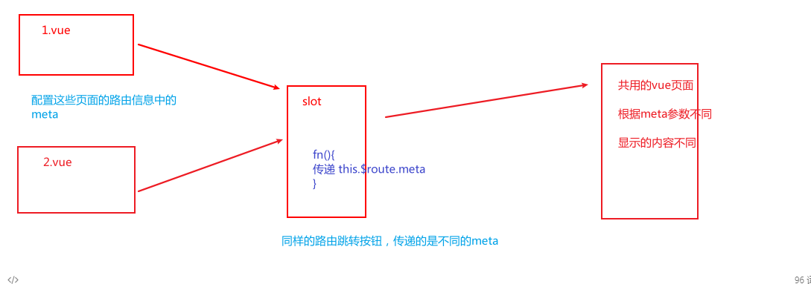
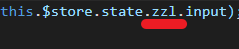
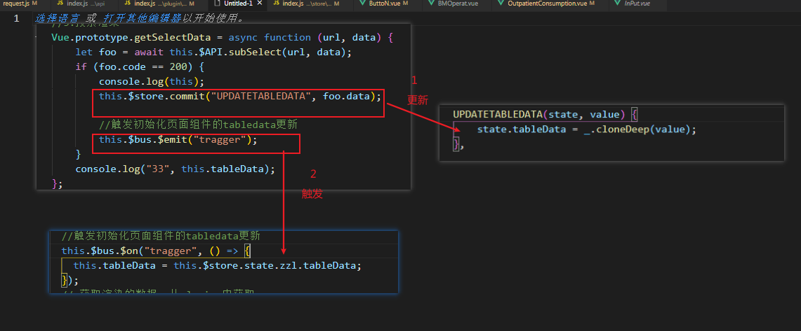
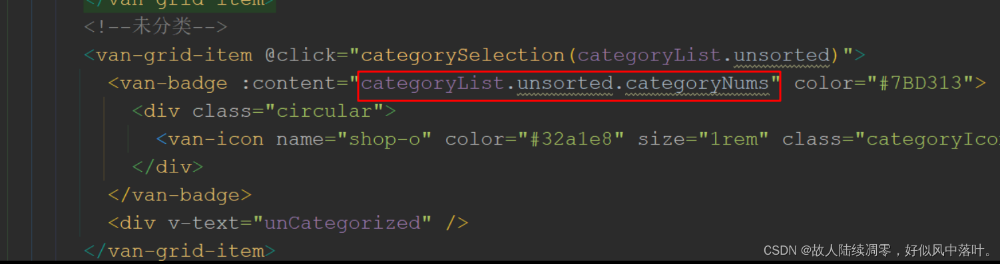
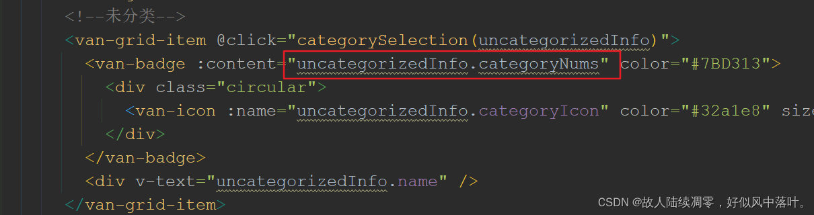
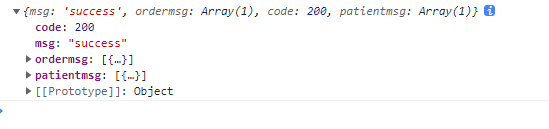
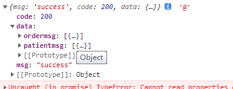

# issue

## 总结：

前期和后端沟通不到位，很多接口和功能没有对接好

页面设计结构古怪，组件和封装不合理

内容功能少，下次做项目需要选择功能多一点的模块


### 1.缺少babel配置文件

> Parsing error: No Babel config file detected

```js
在package.json文件下找到"parserOptions"，添加："requireConfigFile" : false即可

如下：

"parserOptions": {

    "parser": "@babel/eslint-parser",

        "requireConfigFile" : false

},
```

可能是npm没能安装上这个包，手动安装。有可能是node的版本太低，导致不能安装，需要升级node版本


### 2.传递参数的一种思路




### 3.axios 设置不同的请求头

用于解决后端要求传递的参数格式不一样的问题

首先要引入qs包，用于转换请求数据的格式

`import qs from 'qs'`

再设置请求头

`application/x-www-form-urlencoded`

```js
http({
    method: 'post',
    url: 'http://127.0.0.1:10111/heartbeat',
    headers: {
      'Content-Type': 'application/x-www-form-urlencoded'
    },
    data: qs.stringify(data)
})
```

### 4. vuex 分模块暴露使用



需要带上自己的文件名


### 5.在不同AB组件中更新vuex中同样的数据，并让A组件中依赖此数据的data更新

> 为什么要这样？因为如果直接在这里给 tabledat 赋值的话，this指向会出问题，所以要在组件中触发

首先在B中更新vuex，并且需要用事件总线触发一个A中的事件

这个事件会让A中的data再请求一遍vuex中的依赖，从而更新




### 8.赋值变量是一个三段式，

而在VUE的渲染机制中，异步数据先显示初始数据，后面再接着显示连带的数据。

这样会报错



修改后：




### 10.可选链式编程

`xxx?.xxx?.xx`

读取对象属性时，当莫个属性不存在，其后的属性自然访问不到，这样必然会报错。

链式编程在读到不存在的属性时，就不会继续向下执行了


### 11.路由传参 params 和 query

>使用params的路由， 可以在页面使用this.$route.params.xxx 获取参数，相当于post方法，携带的参数不会明文出现在url上。但是刷新路由后，该参数会消失。 不适于需要刷新页面，又可以取数的。

> 使用query的路由，可以在页面使用this.$route.query.xxx 获取参数，相当于get方法。携带的参数能在url上直接看到。即使刷新页面，参数也会一直保留。


1. 组件
   1. 全局事件总线 用于页面组件传值
   2. 父子组件传值 用传统的组件携带参数回调传递
   3. vuex 用于管理登录用户信息 储存多层级组件之间的数据联动
   4. 共用组件抽离 实现共用 eg.页码组件 边栏组件 头部组件 搜索组件 
   5. slot插槽 实现结构相似页面的复用，共用布局样式的同时实现不同功能
2. ui
   1. 第三方富文本框 获取用户编辑内容 实现良好的图形化交互
   2. element-ui
3. 插件
   1. dayjs 用于格式化时间
   2. 自定义 plugins mixin 用于编写共用的函数方法
4. 权限
   1. 后端控制 返回权限菜单 根据不同角色展示不同内容
   2. 封装鉴权功能函数 发送请求时判断有无该功能的权限字段且携带该字段给后端


### 0.litle issue

1. router-view  只是用来显示路由页面的视窗，可以随便放在任意地方。当前路由展示的信息都会被显示在里面
2. 箭头函数的this指向本组件的实例对象，要用箭头函数


1. patientmsg 缺少字段

   1. 证件类型
   2. 关系

2. 备注 请求字段过多

3. 门诊充值渲染接口 字段不符

4. 住院消费操作接口命名 和门诊消费操作接口命名 不规范

5. 住院消费 退款记录 的操作接口 ordermsg返回字段和页面要求的不符

6. 住院消费 住院充值 的操作接口 返回的数据结构和前面的不一样

  

  

  正确的应该是后面那种，把信息放在data中的那种


myissue：

1. 搜索为空值之后，点击路由跳转，应该重新获取初始数据并渲染