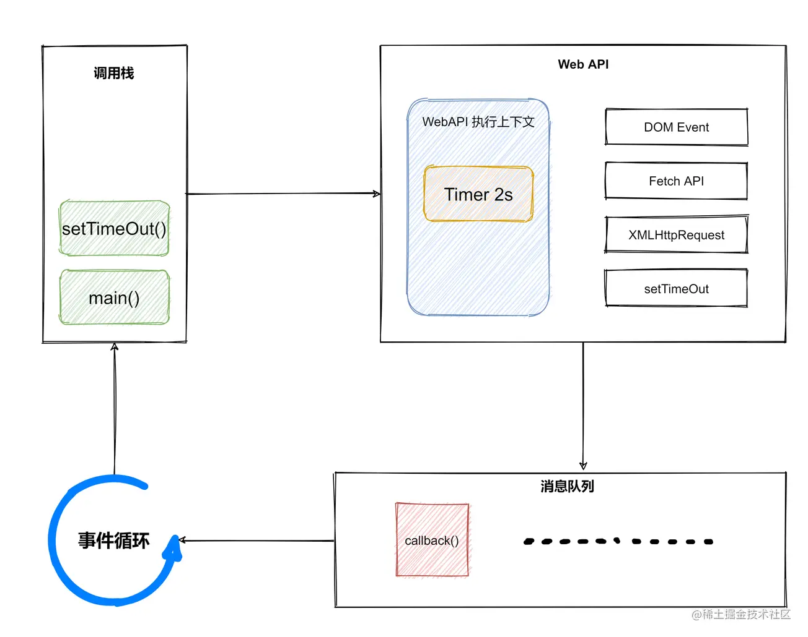
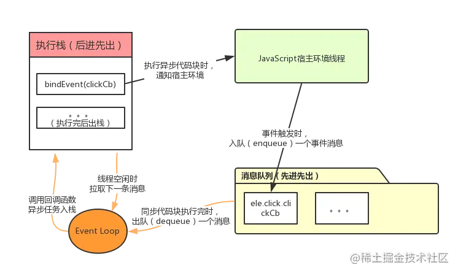
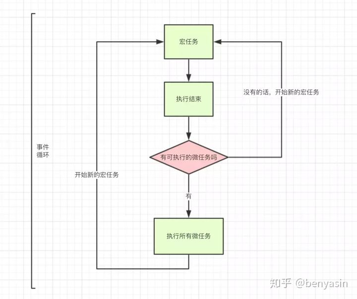

##  异步

js是单线程，但浏览器的渲染进程是多线程的，它们都属于 Web API 的范畴。如下：

- 事件触发线程（DOM Events）
- 定时触发器线程（setTimeOut）
- 异步http请求线程（Fetch API）
- GUI渲染线程


注意，Javascript的全局执行上下文是Javascript引擎的一部分，而 Web API 不是，它会创建一个单独的执行上下文，而且不在Javascript引擎中。


#### 1.JavaScript**执行环境**中存在的两个结构：

**消息队列**(message queue)，也叫任务队列（task queue）：存储待处理消息及对应的回调函数或事件处理程序；

执行栈(execution context stack)，也可以叫**执行上下文栈**：JavaScript执行栈，顾名思义，是由执行上下文组成，当函数调用时，创建并插入一个执行上下文，通常称为执行栈帧（frame），存储着函数参数和局部变量，当该函数执行结束时，弹出该执行栈帧；


Javascript处理异步任务的机制就是：遇到耗时操作（Web API中的方法）就将其耗时的代码放入 WebAPI 的执行上下文栈中运行，运行结束后，将其中包含的回调函数立即放入消息队列中；消息队列会将其中按顺序存放的回调函数，按顺序推入主线程所在的调用栈中执行。

```js
// 耗时操作
function netWork(callback){
	setTimeOut(()=> {
		console.log('get the network source')
		callback()
	},2000)
}

// 等待耗时操作执行完毕
function end(){
	console.log('Finished!')
}

// 模拟一个网络请求操作
netWork(end)

```



下面来解释一下这张图

1. newWork 被推入Javascript全局执行上下文中的调用栈，然后是 setTimeOut 入栈
2. 2秒后 setTimeOut运行完毕，立即将绑定其中的 callback() 推入消息队列
3. 消息队列接受到了 callback() ，于是将 callback() 通过事件循环推入主线程上面执行


Javascript处理异步任务的机制就是这样：**当遇到异步任务，就放入 WebAPI的执行上下文中执行，然后继续执行后面的同步任务；WebAPI则会将异步任务所绑定的回调函数放入消息队列；消息队列再将回调函数按顺序推入主线程中执行**。

注意，消息队列并不是一收到回调函数就立即放入主线程中执行，而是会先检查主线程上是否有别的任务在执行，如果有就等待主线程处理完了再推入回调函数。所谓**事件循环机制**就是循环地去检查主线程是否空闲，一旦空闲就将回调函数放入其中执行。


#### 2.事件循环流程

关于事件循环流程分解如下：

1. 宿主环境为JavaScript创建线程时，会创建堆(heap)和栈(stack)，堆内存储JavaScript对象，栈内存储执行上下文；
2. 栈内执行上下文的同步任务按序执行，执行完即退栈，而当异步任务执行时，该异步任务进入**等待状态**（不入栈），同时通知线程：当触发该事件时（或该异步操作响应返回时），需向消息队列插入一个事件消息；
3. 当事件触发或响应返回时，线程向消息队列插入该事件消息（包含事件及回调）；
4. 当栈内同步任务执行完毕后，线程从消息队列取出一个事件消息，其对应异步任务（函数）入栈，执行回调函数，如果未绑定回调，这个消息会被丢弃，执行完任务后退栈；
5. 当线程空闲（即执行栈清空）时继续拉取消息队列下一轮消息（next tick，事件循环流转一次称为一次tick）。


```js

    var ele = document.querySelector('body');

    function clickCb(event) {
        console.log('clicked');
    }
    function bindEvent(callback) {
        ele.addEventListener('click', callback);
    }    

    bindEvent(clickCb);

```



如上图，当执行栈同步代码块依次执行完直到遇见异步任务时，异步任务进入等待状态，通知线程，异步事件触发时，往消息队列插入一条事件消息；而当执行栈后续同步代码执行完后，读取消息队列，得到一条消息，然后将该消息对应的异步任务入栈，执行回调函数；一次事件循环就完成了，也即处理了一个异步任务。


**定时器：**

```js
setTimeout(function(){console.log(1);}, 0);
```

setTimeout(fn,0)的含义是，指定某个任务在主线程最早可得的空闲时间执行，也就是说，尽可能早得执行。它在"任务队列"的尾部添加一个事件，因此要等到<u>**同步任务和"任务队列"现有的事件都处理完，才会得到执行。**</u>


#### 3.微任务，宏任务

- **宏任务**，macrotask，又称为task，可以理解为每次执行栈执行的代码就是一个宏任务（包括每次从事件队列中获取一个事件回调并放到执行栈中执行）。
  包括：script(整个代码块)，I/O，xhr，setTimeout，setInterval，setImmediate（仅Node），requestAnimationFrame（仅浏览器），UI交互事件, postMessage, MessageChannel
- **微任务**，microtask，又称为job，可以理解是在当前 task 执行结束后立即执行的任务。
  包括：Promise.then catch finally， await后面代码，process.nextTick（仅Node），MutationObserver（仅浏览器）



事件循环**说人话版本**的过程如下：

1. **JS引擎**（唯一主线程）按顺序解析代码，遇到函数声明，直接跳过，遇到函数调用，入栈；
2. 如果是同步函数调用，直接执行得到结果，同步函数弹出栈，继续下一个函数调用；
3. 如果是异步函数调用，分发给**Web API**（多个辅助线程），异步函数弹出栈，继续下一个函数调用；
4. Web API中，异步函数在相应辅助线程中处理完成后，即异步函数达到触发条件了（比如setTimeout设置的10s后），如果异步函数是宏任务，则入宏任务**消息队列**，如果是微任务，则入微任务消息队列；
5. **Event Loop**不停地检查主线程的调用栈与回调队列，当调用栈空时，就把微任务消息队列中的第一个任务推入栈中执行，执行完成后，再取第二个微任务，直到微任务消息队列为空；然后
   去宏任务消息队列中取第一个宏任务推入栈中执行，当该宏任务执行完成后，在下一个宏任务执行前，再依次取出微任务消息队列中的所有微任务入栈执行。
6. 上述过程不断循环，每当微任务队列清空，可作为本轮事件循环的结束。


有几个关键点如下：

1. 所有微任务总会在下一个宏任务之前全部执行完毕，宏任务必然是在微任务之后才执行的（因为微任务实际上是宏任务的其中一个步骤）。
2. 宏任务按顺序执行，且浏览器在每个宏任务之间渲染页面
3. 所有微任务也按顺序执行，且在以下场景会立即执行所有微任务

- 每个回调之后且js执行栈中为空。
- 每个宏任务结束后。


**eg：**

```text
setTimeout(_ => console.log(4))

new Promise(resolve => {
  resolve()
  console.log(1)
}).then(_ => {
  console.log(3)
})

console.log(2)
```

流程如下：

1. 整体script作为第一个宏任务进入主线程，遇到setTimeout入栈处理，发现是异步函数（宏任务），出栈，移交给Web API处理，0秒等待后，将回调函数加到宏任务队列尾部；
2. 遇到new Promise,入栈处理，发现是同步任务，直接执行，console输出1；
3. 遇到then，入栈处理，发现是异步函数（微任务），出栈，移交给Web API处理，将回调函数加入微任务队列尾部；
4. 遇到console.log(2)，入栈处理，同步任务，直接console输出2, 出栈;
5. 栈已清空，检查微任务队列；
6. 取出第一个回调函数，入栈处理，发现是同步任务，直接console输出3, 出栈；
7. 继续从取微任务队列中取下一个，发现微任务队列已清空，结束第一轮事件循环；
8. 从宏任务队列中取出第一个宏任务，入栈处理，发现是同步任务，直接console输出4；

所以，最终输出结果为：1 > 2 > 3 > 4

**eg嵌套：**

```js
//1
Promise.resolve().then(() => {
    //1.1
    console.log("Promise1");
    //3
    setTimeout(() => {
        //3.1
        console.log("setTimeout2");
    }, 0);
});
//2
setTimeout(() => {
    //2.1
    console.log("setTimeout1");
    //2.2
    Promise.resolve().then(() => {
        console.log("Promise2");
    });
}, 0);
//promise1=> setTimeout1=> promise2=> settimeout2

```

